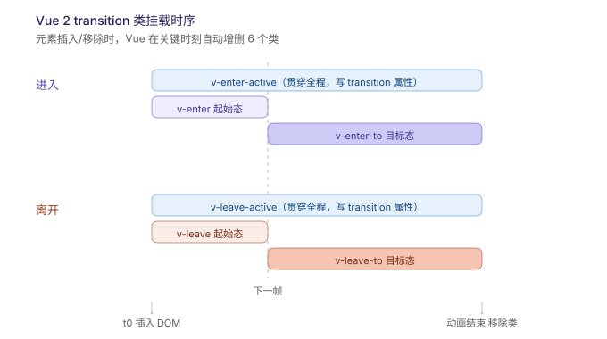

# 前端框架问题

## Vue 路由：`query` vs `params`

1. **URL 表现形式**
   - query：参数以 `?key=value` 形式附加在 URL 后面，如 `/search?keyword=vue&page=1`
   - params：参数嵌入在 URL 路径中，如 `/user/123`

2. **路由配置**
   - query：无需在路由配置中预定义，随时可加任意键值对
   - params：必须在路由配置中声明动态段，如 `path: '/user/:id'`

3. **跳转方式**
   - query：支持 `path` 或 `name` 跳转
     ```js
     this.$router.push({ path: "/search", query: { keyword: "vue" } });
     ```
   - params：**必须使用 `name` 跳转**，用 `path` 会导致参数丢失
     ```js
     this.$router.push({ name: "User", params: { id: 123 } });
     ```

4. **取值方式**
   - query：`this.$route.query.keyword`
   - params：`this.$route.params.id`

5. **刷新行为**
   - query：参数保留在 URL 中，刷新后不丢失
   - params：如果路由 path 中定义了动态段（如 `/user/:id`），刷新后参数仍在 URL 路径中，不会丢失；但如果 params 是隐式传递（未在路径中定义），刷新后会丢失

## 浅谈Vue 2 中的 `computed` 实现

Vue 2 中 `computed` 的实现，本质上是**基于响应式系统（Dep/Watcher）+ 惰性求值（lazy）+ 脏标记（dirty）缓存**三者协作的结果。

::: info 整体流程图

```
初始化
  │
  ├─ 创建 computed Watcher（lazy: true, dirty: true）
  ├─ 不执行 getter，不收集依赖
  │
首次访问 computed
  │
  ├─ dirty === true → 执行 evaluate()
  │   ├─ 调用 getter → 触发依赖数据的 get → 收集依赖
  │   ├─ 缓存结果到 watcher.value
  │   └─ dirty = false
  │
再次访问（依赖未变）
  │
  ├─ dirty === false → 直接返回 watcher.value（命中缓存）
  │
依赖数据变化
  │
  ├─ 触发 computed Watcher 的 update()
  ├─ dirty = true（仅标记，不计算）
  │
下次访问
  │
  └─ dirty === true → 重新 evaluate() → 重新收集依赖 → 更新缓存
```

- 每个 computed 属性对应一个 **computed Watcher**，存储在 `vm._computedWatchers` 中
- 创建时传入 `{ lazy: true }`，表示**惰性求值**——初始化时不执行 getter，不会立即计算

:::

## 发布订阅 与 观察者模式

**发布订阅者模式与观察者模式的核心区别在于：观察者模式是“直接通知”，发布订阅者模式是“通过中间人转发”。** 虽然两者都属于行为型设计模式且用于解耦，但在实现机制、耦合度和应用场景上存在本质差异。

| 维度     | 观察者模式            | 发布订阅者模式                     |
| -------- | --------------------- | ---------------------------------- |
| 耦合度   | 松耦合（但直接引用）  | 完全解耦                           |
| 中间层   | 无                    | 有（消息代理/事件总线）            |
| 通信方式 | 同步、直接调用        | 可同步可异步，间接转发             |
| 扩展性   | 一般                  | 更强，新增订阅者无需改动发布者     |
| 典型场景 | UI 事件监听、数据绑定 | 消息队列、微服务通信、事件驱动架构 |

### 观察者模式

- **结构**：Subject（被观察者）直接维护一个 Observer（观察者）列表，状态变化时主动遍历调用所有观察者的更新方法。
- **耦合度**：观察者和被观察者**直接耦合**，被观察者必须知道观察者的存在。
- **通信方式**：一对一或多对一的直接推送。

::: info 观察者模式代码示例

**核心：Subject 直接持有 Observer 列表，状态变了直接调用。**

```js
class Subject {
  constructor() {
    this.observers = [];
  }
  subscribe(observer) {
    this.observers.push(observer);
  }
  unsubscribe(observer) {
    this.observers = this.observers.filter((obs) => obs !== observer);
  }
  notify(data) {
    // 直接遍历调用每个观察者的 update 方法
    this.observers.forEach((observer) => observer.update(data));
  }
}

class Observer {
  constructor(name) {
    this.name = name;
  }
  update(data) {
    console.log(`${this.name} 收到通知：`, data);
  }
}

// 使用
const subject = new Subject();
const obsA = new Observer("观察者A");
const obsB = new Observer("观察者B");

subject.subscribe(obsA);
subject.subscribe(obsB);
subject.notify("数据变了！");
// 观察者A 收到通知：数据变了！
// 观察者B 收到通知：数据变了！
```

:::

### 发布订阅者模式

- **结构**：引入一个中间层——**消息代理（Broker/Event Bus）**。发布者将消息发到代理的某个频道，订阅者向代理订阅感兴趣的频道，两者互不知道对方的存在。
- **耦合度**：发布者和订阅者**完全解耦**，仅通过消息代理间接通信。
- **通信方式**：多对多，基于频道/主题的广播。

::: info 发布订阅者模式代码示例

**核心：引入 EventBus 中间层，发布者和订阅者互不认识。**

```js
class EventBus {
  constructor() {
    this.events = {}; // { 事件名: [回调函数列表] }
  }
  on(event, callback) {
    if (!this.events[event]) this.events[event] = [];
    this.events[event].push(callback);
  }
  emit(event, data) {
    if (this.events[event]) {
      this.events[event].forEach((cb) => cb(data));
    }
  }
  off(event, callback) {
    if (this.events[event]) {
      this.events[event] = this.events[event].filter((cb) => cb !== callback);
    }
  }
}

// 使用
const bus = new EventBus();

// 订阅者A 和 订阅者B 互不认识，也不知道谁发布的
bus.on("user:login", (user) => console.log("更新用户信息：", user));
bus.on("user:login", (user) => console.log("同步购物车：", user));

// 发布者在另一个模块，只管发，不管谁收
bus.emit("user:login", { name: "张三" });
// 更新用户信息：{ name: '张三' }
// 同步购物车：{ name: '张三' }
```

:::

### JS中的应用场景

- **DOM 事件系统** — 浏览器本身就是发布订阅：`addEventListener` 是订阅，用户操作触发 `dispatchEvent` 是发布
- **Node.js 的 `EventEmitter`** — 经典的发布订阅实现，`on`/`emit`/`off` 三件套
- **Vue 2 的 EventBus** — `new Vue()` 作为中央事件总线，`$emit`/`$on`/`$off`
- **Vue 3 的响应式系统** — 基于 `Proxy` 的 `Dep`（依赖收集）+ `effect`（副作用追踪），本质是观察者模式

## Vue中computed和watch的区别

| 维度     | computed                                  | watch                                                 |
| -------- | ----------------------------------------- | ----------------------------------------------------- |
| 定位     | **派生值**（由已有数据算出新值）          | **副作用**（变化时执行一段逻辑）                      |
| 缓存     | ✅ 有缓存，依赖不变则直接返回旧值         | ❌ 无缓存，变化必执行                                 |
| 返回值   | 必须 `return`，模板/逻辑直接消费          | 回调**无返回值**，结果靠副作用（改 data、发请求）     |
| 触发时机 | **惰性**：被「读取」时才算（dirty 机制）  | 依赖一变**立即**触发，不管有没有人读                  |
| 异步     | ❌ 不应有异步逻辑（getters 要同步返回值） | ✅ 天然适合异步（防抖请求等）                         |
| 监听范围 | 依赖收集，声明里用到谁就监听谁            | 显式声明监听谁，支持 `deep` / `immediate`             |
| 典型场景 | fullName、过滤列表、总价、状态拼接        | 路由变化、props 深层变化、联动请求、localStorage 同步 |

```js
export default {
  data: () => ({ firstName: "Gui", lastName: "Xian", userId: 1 }),

  // 场景1：拼接显示 —— 用 computed
  computed: {
    // 只依赖 firstName/lastName，其他数据变了不会触发重算
    fullName() {
      return this.firstName + " " + this.lastName;
    },
    // 带完整 get/set 的写法（v-model 绑 computed 的关键）
    fullNameTwo: {
      get() {
        return this.firstName + " " + this.lastName;
      },
      set(val) {
        [this.firstName, this.lastName] = val.split(" ");
      },
    },
  },

  watch: {
    // 场景2：变化后要做「别的事」—— 用 watch
    userId: {
      handler(newVal, oldVal) {
        this.fetchUser(newVal); // 异步请求，computed 干不了这事
      },
      immediate: true, // 组件创建时立即执行一次（否则初始值不触发）
      // deep: true,    // 监听对象内部属性变化，深度遍历有性能开销
    },
  },
  methods: {
    fetchUser(id) {
      /* ... */
    },
  },
};
```

::: warning ⚠️ 注意

**1. computed 的缓存本质是 `dirty` 标记**  
依赖变化时它**不会立刻重算**，只是把 `dirty` 置为 true；等下次有人读它才真正执行 getter。所以「依赖变了但你从不读」→ 一次都不会算。这和 watch 的「变了就执行」是根本区别。

**2. computed 不能被「异步」污染**  
getter 必须同步 return。异步结果回来时函数早返回了，拿到的是 undefined。

**3. watch 对象属性，默认是浅监听**  
`deep` 监听时回调拿到的 `newVal === oldVal`（同一个对象引用），要拿到变化得用 `$watch` 字符串路径或展开符快照。

**4. watch 一个 computed 是合法且常用的组合**  
例如 `watch: { fullName(val) { this.updateTitle(val) } }` —— 依赖 computed 的值做副作用。

:::

## Vue中`transition`组件

`<transition>` 本身不渲染额外 DOM，它只是个**状态机包裹器**。在你用 `v-if / v-show / 动态组件 / 路由切换` 让元素「出现/消失」时，自动在关键时刻**挂载/卸载 6 个 CSS 类**，只需对这些类写动画即可。



### 6个CSS类（Vue2命名）

| 阶段 | 类名             | 存在窗口            | 你通常写什么                                           |
| ---- | ---------------- | ------------------- | ------------------------------------------------------ |
| 进入 | `v-enter`        | t0 瞬间（下一帧前） | **起始态**：`opacity:0; transform:translateY(-20px)`   |
| 进入 | `v-enter-active` | 全程                | **`transition: all .3s`** + 可写 enter-to 的目标值兜底 |
| 进入 | `v-enter-to`     | 下一帧 → 结束       | **目标态**：`opacity:1; transform:none`                |
| 离开 | `v-leave`        | 离开 t0（下一帧前） | 起始态（一般和默认态一致，可省略）                     |
| 离开 | `v-leave-active` | 全程                | **`transition: all .3s`**                              |
| 离开 | `v-leave-to`     | 下一帧 → 结束       | 目标态：`opacity:0; transform:translateY(-20px)`       |

### 基础用法（Vue 2）

```html
<template>
  <div>
    <button @click="show = !show">toggle</button>

    <!-- name 自定义前缀，否则默认是 v- -->
    <transition name="fade">
      <p v-if="show">Hello Vue Transition</p>
    </transition>
  </div>
</template>

<style>
  /* 进入/离开的「怎么动」：过渡属性写在 active 类 */
  .fade-enter-active,
  .fade-leave-active {
    transition: opacity 0.3s ease;
  }
  /* 起始态 与 目标态 */
  .fade-enter,
  .fade-leave-to {
    opacity: 0;
  }
</style>
```

### `<transition-group>`：列表动画

`<transition>` 只能包**单个**元素/组件；多个元素（如 `v-for` 列表）要用 `<transition-group>`，它**会渲染一个真实 DOM 容器**（默认 `<span>`，可用 `tag` 改）。

```html
<transition-group name="list" tag="ul">
  <li v-for="item in items" :key="item.id">{{ item.text }}</li>
</transition-group>

<style>
  .list-enter-active,
  .list-leave-active {
    transition: all 0.5s;
  }
  .list-enter,
  .list-leave-to {
    opacity: 0;
    transform: translateX(30px);
  }
  /* 列表「挪位置」的平滑移动，必加 */
  .list-move {
    transition: transform 0.5s;
  }
</style>
```

⚠️ 列表动画两大坑（面试高频）：

1. **每个子项必须有唯一 `key`**，且不能是 `index`（index 会随删除错位，导致动画错乱）。
2. 离开的元素**默认脱离文档流前会占位**，要让其他项平滑顶上来，需给 `v-leave-active` 加 `position: absolute`（否则 `list-move` 看着像「瞬间跳位」）。

### 过渡模式 `mode`

两个元素切换（如 `v-if / v-else`）默认「旧走新来同时发生」，会重叠/闪跳。用 `mode` 控制顺序：

| mode     | 行为                       | 场景                               |
| -------- | -------------------------- | ---------------------------------- |
| `in-out` | 新元素先进，旧元素再离     | 较少用                             |
| `out-in` | **旧元素先离，新元素再进** | 路由切换、tab 切换最常用，避免重叠 |

```html
<transition name="fade" mode="out-in">
  <component :is="currentTab" />
</transition>
```

### JS 钩子（钩子函数）

纯 CSS 不够时（如动画库、或不知道结束时间），用 JS 钩子，配合 `:css="false"` 让 Vue 跳过 CSS 检测、完全由你控制：

```html
<transition
  @before-enter="beforeEnter"
  @enter="enter"
  @after-enter="afterEnter"
  @before-leave="beforeLeave"
  @leave="leave"
  :css="false"
>
  <p v-if="show">JS 控制动画</p>
</transition>

<script>
  export default {
    methods: {
      // el 是真实 DOM；done 是「动画结束」回调（必须调，否则 Vue 不知道何时移除）
      enter(el, done) {
        el.style.opacity = 0;
        // 用 requestAnimationFrame 或动画库，结束后调 done()
        requestAnimationFrame(() => {
          el.style.transition = "opacity .5s";
          el.style.opacity = 1;
          el.addEventListener("transitionend", done, { once: true });
        });
      },
      leave(el, done) {
        /* 同理，结束时 done() */
      },
    },
  };
</script>
```

> 钩子函数列表（对应 6 个类）：`before-enter` / `enter` / `after-enter` / `enter-cancelled` 与 `before-leave` / `leave` / `after-leave` / `leave-cancelled`。

### 面试高频 Q&A

**Q：`transition` 为什么必须包单个根元素？**  
A：因为同一时刻只能决定「一个元素」的进入/离开状态。多个并列子节点时要用 `transition-group`，且每个子节点要有 `key`。

**Q：`v-show` 和 `v-if` 触发的过渡有区别吗？**  
A：都有。`v-show` 是display 切换，触发 enter/leave；`v-if` 是真正的挂载/卸载，触发同样流程。注意 `v-show` 初始为 `false` 时不会触发「进入」动画（已经在 DOM 里了）。

**Q：初始渲染就想有动画？**  
A：给 `<transition appear>` 加 `appear`，并写 `*-appear / *-appear-active / *-appear-to` 三件套（或 `appear` 钩子）。

**Q：如何给多个不同动画的元素批量用？**  
A：`name` 属性统一前缀，或在 `<transition>` 上用 `enter-class` / `enter-active-class` 等**自定义类绑定**，把动画名直接传进去（配合 Animate.css 很常见）。

### Vue 2 vs Vue 3 命名差异

| 概念                    | Vue 2                       | Vue 3                                                       |
| ----------------------- | --------------------------- | ----------------------------------------------------------- |
| 起始态类                | `v-enter` / `v-leave`       | `v-enter-from` / `v-leave-from`（`*-from` 更语义化）        |
| 目标态类                | `v-enter-to` / `v-leave-to` | 同 Vue 2                                                    |
| active 类               | 不变                        | 不变                                                        |
| `transition-group` 渲染 | 默认 `<span>`，可 `tag`     | 默认不再渲染根元素（Vue 3.4+ 行为），需手动包一层或用 `tag` |
| 根节点要求              | 单根                        | 支持多根（fragment），但过渡仍建议单元素                    |
