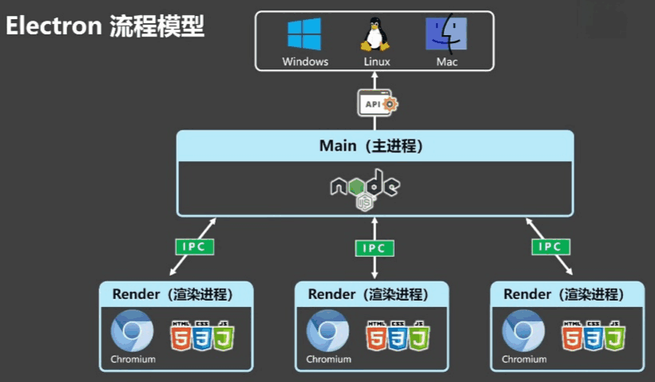

# Electron 基础

> Electron 更新非常快，当前笔记是基于v11.2.0版本。
>
> 最新版本已更新至v43.1.0，后期笔记需要根据新版本进行更新。

## Electron 基本认知

### 概述



**Electron 的技术架构**由 Chromium、Node.js、Native APIs 三部分构成，分别承担不同功能：

- Chromium：支持最新特性的浏览器
- Node.js：javascript 运行时，可实现文件读写等
- Native APIs：提供统一的原生界面能力

**主进程**

- 可以看做是 package.json 中 main 属性对应的文件
- 一个应用只会有一个主进程
- 只有主进程可以进行 GUI 的 API 操作

**渲染进程**

- Windows 中展示的界面通过渲染进程表现
- 一个应用可以有多个渲染进程

### 基本环境搭建

```js
// 用于控制应用生命周期和创建原生浏览器窗口的模块
const { app, BrowserWindow } = require("electron");
const path = require("path");

// 01 创建一个窗口
// 02 让窗口加载了一个界面，这个界面就是用 web 技术实现，这个界面是运行在渲染进程中的
function createWindow() {
  // 创建浏览器窗口
  const mainWindow = new BrowserWindow({
    width: 800,
    height: 600,
    webPreferences: {
      preload: path.join(__dirname, "preload.js"),
    },
  });
  // 加载应用的 index.html 文件
  mainWindow.loadFile("index.html");
  // 打开开发者工具
  // mainWindow.webContents.openDevTools()
}

// 当 Electron 完成初始化并准备好创建浏览器窗口时，会调用此方法
// 某些 API 只能在此事件发生后使用
app.whenReady().then(() => {
  createWindow(); // 主窗口已经渲染出来了

  // 监听 'activate' 事件（主要用于 macOS）
  app.on("activate", function () {
    // 在 macOS 上，当点击 Dock 图标且没有其他窗口打开时，通常会重新创建一个窗口
    if (BrowserWindow.getAllWindows().length === 0) createWindow();
  });
});

// 当所有窗口都关闭时退出应用，macOS 除外
// 在 macOS 上，应用及其菜单栏通常会保持活跃状态，直到用户通过 Cmd + Q 显式退出
app.on("window-all-closed", function () {
  if (process.platform !== "darwin") app.quit();
});
```

::: warning ⚠️ 注意
国内网络解决 npm 安装 electron 失败的问题

```bash
npm install -g cnpm --registry=https://registry.npmmirror.com
cnpm install --save-dev electron
```

:::

### 生命周期事件

**主进程生命周期事件**

Electron 应用的生命周期由 `app` 模块管理，以下是主要事件：

| 事件                | 触发时机                   | 说明                                 |
| ------------------- | -------------------------- | ------------------------------------ |
| `ready`             | 应用初始化完成             | 所有 API 可用，通常在此创建窗口      |
| `window-all-closed` | 所有窗口关闭               | macOS 上应用不会退出，其他平台会退出 |
| `activate`          | macOS 点击 Dock 图标       | 通常用于重建窗口                     |
| `before-quit`       | 应用退出前                 | 可取消退出                           |
| `will-quit`         | 所有窗口关闭后、应用退出前 | 可取消退出                           |
| `quit`              | 应用退出时                 | 不可取消                             |

```js
const { app, BrowserWindow } = require("electron");

app.on("ready", () => {
  console.log("应用初始化完成");
  createWindow();
});

app.on("window-all-closed", () => {
  console.log("所有窗口已关闭");
  if (process.platform !== "darwin") app.quit();
});

app.on("activate", () => {
  console.log("应用激活");
  if (BrowserWindow.getAllWindows().length === 0) createWindow();
});

app.on("before-quit", (event) => {
  console.log("应用即将退出");
  // event.preventDefault(); // 取消退出
});

app.on("will-quit", (event) => {
  console.log("所有窗口关闭，即将退出");
});

app.on("quit", () => {
  console.log("应用已退出");
});
```

::: warning ⚠️ 注意

- `whenReady()` 是 `ready` 事件的 Promise 版本，推荐使用
- macOS 上点击 Dock 图标触发 `activate`，此时若无窗口需重建
- 关闭所有窗口并不意味着应用退出，需监听 `window-all-closed` 手动退出
- 当监听了`window-all-closed`事件并且不做任何操作时时，`before-quit`、`will-quit`、`quit`，这三个事件就会失效

:::

---

**渲染进程生命周期事件**

渲染进程的生命周期与浏览器页面类似，主要通过 `window` 对象和 `webContents` 模块来管理。核心事件包括：

| 事件              | 触发时机                    | 说明                                                       |
| :---------------- | :-------------------------- | :--------------------------------------------------------- |
| `dom-ready`       | 页面 DOM 树构建完成时触发   | 可操作 DOM，常用于初始化 UI 组件或绑定事件。               |
| `did-finish-load` | 页面完全加载完成时触发      | 所有资源加载完毕，且 `onload` 事件已触发。                 |
| `will-navigate`   | 页面即将导航到新 URL 时触发 | 可通过 `event.preventDefault()` 阻止导航。                 |
| `did-navigate`    | 页面导航完成时触发          | 仅在主框架导航完成时触发。                                 |
| `close`           | 窗口即将关闭时触发          | 此时窗口仍可见，可调用 `event.preventDefault()` 阻止关闭。 |
| `destroyed`       | 窗口被销毁、资源释放后触发  | 此时窗口对象已不可用，适合做最终清理工作。                 |

```js
function createWindow() {
  app.whenReady().then(() => {
    const mainWin = new BrowserWindow({
      width: 600,
      height: 400,
    });

    mainWin.loadFile("index.html");
    // DOM 树构建完成
    mainWin.webContents.on("dom-ready", () => {});
    // 页面完全加载完成（包括资源）
    mainWin.webContents.on("did-finish-load", () => {});
    // 窗口关闭事件
    mainWin.on("close", (mainWin) => {});
  });
}
```

::: tip 生命周期事件可以写多个处理函数

```js
app.on("ready", createWindow);
app.on("ready", () => {});
```

:::

## 窗口

### 窗口尺寸

```js
let mainWin = new BrowserWindow({
  x: 100,
  y: 100, // 设置窗口显示的位置，相对于当前屏幕的左上角
  show: false, // 默认情况下创建一个窗口对象之后就会显示，设置为false 就不会显示了
  width: 800,
  height: 400,
  maxHeight: 600,
  maxWidth: 1000,
  minHeight: 200,
  minWidth: 300, // 可以通过 min max 来设置当前应用窗口的最大和最小尺寸
  resizable: false, // 是否允许缩放应用的窗口大小
});

mainWin.loadFile("index.html");
mainWin.on("ready-to-show", () => {
  mainWin.show();
});
```

> 当设置 `show` 为 `false` 时，通常是为了让内容渲染完后再去展示。

### 窗口标题及主/渲染进程环境

**主进程配置:**

```js
const { app, BrowserWindow } = require("electron");

// 将创建窗口独立成一个函数
function createWindow() {
  let mainWin = new BrowserWindow({
    show: true,
    width: 800,
    height: 600,
    frame: true, // 用于自定义 menu，设置为 false 可以将默认的菜单栏隐藏（补充：frame为false时，窗口只展示内容部分，title和menubar都会隐藏）
    // transparent: true,
    autoHideMenuBar: true,
    icon: "lg.ico", // 设置一个图片路径，可以自定义当前应用的显示图标
    title: "cris", // 自定义当前应用的显示标题
    webPreferences: {
      nodeIntegration: true, // 控制渲染进程是否允许使用electron、remote等node模块的
      enableRemoteModule: true,
    },
  });

  mainWin.loadFile("index.html");
  mainWin.on("ready-to-show", () => {
    mainWin.show();
  });
}
```

::: info Isolated World
**问题解决：** 实际开发中发现需要再设置 `contextIsolation`，在渲染进程中才能使用 `require` 语法。
当你在 `webPreferences` 属性中启用 **contextIsolation** (Electron 12.0.0 及以上版本默认启用)，你的预加载脚本将运行在一个“被隔离的环境”中。

```js
webPreferences: {
  contextIsolation: false;
}
```

:::

---

**渲染进程配置:**

```js
const { remote } = require("electron");

window.addEventListener("DOMContentLoaded", () => {
  // 点击按钮打开一个新窗口
  const oBtn = document.getElementById("btn");
  oBtn.addEventListener("click", () => {
    // 如何去创建窗口
    let indexMin = new remote.BrowserWindow({
      // 渲染进程中无法直接使用browserWindow，需要使用remote来操作
      width: 200,
      height: 200,
    });
    indexMin.loadFile("list.html");

    indexMin.on("close", () => {
      indexMin = null;
    });
  });
});
```

---

::: info electron debug 快捷键

- Reload: Ctrl+R
- Force Reload: Ctrl+Shift+R
- Toggle Developer Tools: Ctrl+Shift+I
- Actual Size: Ctrl+0
- Zoom In: Ctrl++
- Zoom Out: Ctrl+-
- Toggle Full Screen: F11

:::

### 自定义窗口

**自定义窗口的关闭、最大化、最小化**

```js
aBtn[0].addEventListener("click", () => {
  // 当前事件发生后说明需要关闭窗口
  mainWin.close();
});

aBtn[1].addEventListener("click", () => {
  // 这里需要执行的最大化操作
  if (!mainWin.isMaximized()) {
    mainWin.maximize(); // 让当前窗口最大化
  } else {
    mainWin.restore(); // 回到原始的状态
  }
});

aBtn[2].addEventListener("click", () => {
  // 实现最小化
  if (!mainWin.isMinimized()) {
    mainWin.minimize();
  }
});
```

---

**阻止窗口关闭逻辑 (渲染进程)**

**注意：** `close()` 时会触发 `onbeforeunload`。

```js
window.addEventListener("DOMContentLoaded", () => {
  window.onbeforeunload = function () {
    let oBox = document.getElementsByClassName("isClose")[0];
    oBox.style.display = "block";

    let yesBtn = oBox.getElementsByTagName("span")[0];
    let noBtn = oBox.getElementsByTagName("span")[1];

    yesBtn.addEventListener("click", () => {
      // 不能再用 close() 来关闭，会死循环
      mainWin.destroy();
    });

    noBtn.addEventListener("click", () => {
      oBox.style.display = "none";
    });
  };
});
```

### 子窗口/模态窗口

```js
const { remote } = require("electron");

window.addEventListener("DOMContentLoaded", () => {
  let oBtn = document.getElementById("btn");
  oBtn.addEventListener("click", () => {
    let subWin = new remote.BrowserWindow({
      parent: remote.getCurrentWindow(), // 设置父窗口
      width: 200,
      height: 200,
      modal: true, // 模态窗口打开时父窗口不能进行操作，普通子窗口没有限制
    });

    subWin.loadFile("sub.html");
    subWin.on("close", () => {
      subWin = null;
    });
  });
});
```

::: warning ⚠️ 注意

Electron 较新的版本（v14+）中，`remote` 模块已被默认移除。  
如果你使用的是新版本，建议通过 `ipcRenderer` 和 `ipcMain` 进行进程间通信来实现相同的功能，或者使用 `@electron/remote` 这个独立包。

:::

## 菜单

### 自定义菜单

```js
// **导入菜单模块**
const { app, BrowserWindow, Menu } = require("electron");

// **编写菜单模板**
let menuTemp = [
  {
    label: "文件",
    submenu: [
      {
        label: "打开文件", // 菜单项的事件函数
        click() {},
      },
      {
        type: "separator", // 菜单分割线
      },
      {
        label: "关闭文件夹",
      },
    ],
  },
  {
    label: "关于",
    role: "about", // 菜单项预制的能力
  },
];

// **添加菜单到应用**
let menu = Menu.buildFromTemplate(menuTemp);
Menu.setApplicationMenu(menu);
```

> **补充说明：Role 属性可选值**
>
> `role` (String, optional) - 可以是以下值之一：
> `undo`, `redo`, `cut`, `copy`, `paste`, `pasteAndMatchStyle`, `delete`, `selectAll`, `reload`, `forceReload`, `toggleDevTools`, `resetZoom`, `zoomIn`, `zoomOut`, `togglefullscreen`, `window`, `minimize`, `close`, `help`, `about`, `services`, `hide`, `hideOthers`, `unhide`, `quit`, `startSpeaking`, `stopSpeaking`, `zoom`, `front`, `appMenu`, `fileMenu`, `editMenu`, `viewMenu`, `recentDocuments`, `toggleTabBar`, `selectNextTab`, `selectPreviousTab`, `mergeAllWindows`, `clearRecentDocuments`, `moveTabToNewWindow` or `windowMenu`。
>
> _作用：定义菜单项的行为，当指定了 `click` 处理器时会被忽略。_

### 菜单角色及类型、自定义菜单项

通过 `role` 属性可以直接调用 Electron 内置的预设功能（如复制、剪切等），无需手动编写逻辑。

```js
{
    label: '角色',
    submenu: [
        { label: '复制', role: 'copy' },
        { label: '剪切', role: 'cut' },
        { label: '粘贴', role: 'paste' },
        { label: '最小化', role: 'minimize' },
    ]
}
```

展示了菜单项的不同交互形态，包括复选框 (`checkbox`)、单选框 (`radio`) 以及子菜单嵌套 (`submenu`)。

```js
{
    label: '类型',
    submenu: [
        { label: '选项1', type: 'checkbox' },
        { label: '选项2', type: 'checkbox' },
        { type: "separator" }, // 分割线
        { label: 'item1', type: "radio" },
        { label: 'item2', type: "radio" },
        { type: "separator" },
        { label: 'windows', type: 'submenu', role: 'windowMenu' } // 窗口管理子菜单
    ]
}
```

添加图标、设置快捷键 (`accelerator`) 以及绑定点击事件 (`click`)。

```js
{
    label: '其它',
    submenu: [
        {
            label: '打开',
            icon: './open.png',           // 菜单项图标路径
            accelerator: 'ctrl + o',      // 快捷键设置
            click() {                     // 点击回调函数
                console.log('open操作执行了')
            }
        }
    ]
}
```

### 动态创建菜单

1. 初始化与 DOM 获取

首先引入 `remote` 模块中的 `Menu` 和 `MenuItem` 类，并在页面加载完成后获取相关的 DOM 元素。

```js
const { remote } = require("electron");
const Menu = remote.Menu;
const MenuItem = remote.MenuItem;

window.addEventListener("DOMContentLoaded", () => {
  // 获取要应的元素
  let addMenu = document.getElementById("addMenu");
  let menuCon = document.getElementById("menuCon");
  let addItem = document.getElementById("addItem");

  // ... 后续逻辑 ...
});
```

2. 生成自定义菜单

监听“添加菜单”按钮的点击事件，创建两个新的菜单项（“文件”和“编辑”），并将它们组合成一个新的应用菜单设置到应用中。

```js
// 生成自定义的菜单
addMenu.addEventListener("click", () => {
  // 创建菜单项
  let menuFile = new MenuItem({ label: "文件", type: "normal" });
  let menuEdit = new MenuItem({ label: "编辑", type: "normal" });

  // 将创建好的自定义菜单添加至 menu
  let menu = new Menu();
  menu.append(menuFile);
  menu.append(menuEdit);

  // 将 menu 放置于 app 中显示
  Menu.setApplicationMenu(menu);
});
```

3. 动态添加菜单项

定义一个全局变量 `menuItem` 存储当前的菜单实例，并监听“添加子项”按钮。当用户输入内容并点击按钮时，会动态向该菜单中追加一个新的 `MenuItem`。

```js
// 自定义全局变量存放菜单项
let menuItem = new Menu();

// 动态添加菜单项
addItem.addEventListener("click", () => {
  // 获取当前 input 输入框当中的内容
  let con = menuCon.value.trim();
  if (con) {
    menuItem.append(new MenuItem({ label: con, type: "normal" }));
    menuCon.value = "";
  }
});
```

### 右键菜单

1. 引入模块与定义模板

```js
const { remote } = require("electron");
const Menu = remote.Menu;

let contextTemp = [
  { label: "Run Code" },
  { label: "转到定义" },
  { type: "separator" }, // 分割线
  {
    label: "其它功能",
    click() {
      console.log("其它功能选项被点击了");
    },
  },
];
```

2. 生成菜单并绑定事件

使用 `buildFromTemplate` 将数组转换为菜单对象，然后监听窗口的 `contextmenu` 事件。在事件中阻止默认行为，并调用 `popup` 方法显示自定义菜单。

```js
// 依据上述的内容来创建 menu
let menu = Menu.buildFromTemplate(contextTemp);

// 给鼠标右击添加监听
window.addEventListener("DOMContentLoaded", () => {
  window.addEventListener("contextmenu", (ev) => {
    ev.preventDefault(); // 阻止默认的浏览器右键菜单
    menu.popup({ window: remote.getCurrentWindow() }, false);
  });
});
```

## 主/渲染进程通信

### 主进程与渲染进程通信

#### 渲染进程发送消息到主进程

**渲染进程代码 (Renderer Process)**

在渲染进程中，通过 `ipcRenderer` 模块向主进程发送消息，并监听主进程的回复。

```js
const { ipcRenderer } = require("electron");

window.onload = function () {
  // 获取元素
  let abtn = document.getElementsByTagName("button");

  // 01 采用异步的 API 在渲染进程中给主进程发送消息
  abtn[0].addEventListener("click", () => {
    ipcRenderer.send("msg1", "当前是来自渲染进程的一条异步消息");
  });

  // 当前区域是接收消息 (监听主进程的回复)
  ipcRenderer.on("msg1Re", (ev, data) => {
    console.log(data);
  });

  // 02 采用同步的方式完成数据通信
  abtn[1].addEventListener("click", () => {
    let val = ipcRenderer.sendSync("msg2", "同步消息");
    console.log(val);
  });
};
```

---

**主进程代码 (Main Process)**

在主进程中，通过 `ipcMain` 模块监听来自渲染进程的消息，并进行处理或回复。

```js
const { app, BrowserWindow, ipcMain } = require("electron");

// 主进程接收消息操作 (处理异步消息)
ipcMain.on("msg1", (ev, data) => {
  console.log(data);
  // 向发送消息的渲染进程回复消息
  ev.sender.send("msg1Re", "这是一条来自于主进程的异步消息");
});

// 处理同步消息
ipcMain.on("msg2", (ev, data) => {
  console.log(data);
  // 直接通过 returnValue 返回数据给渲染进程
  ev.returnValue = "来自于主进程的同步消息";
});
```

#### 主进程发送消息到渲染进程

**主进程代码 (Main Process)**

在主进程中，通过 `BrowserWindow` 实例获取 `webContents` 对象，然后调用 `.send()` 方法向该窗口发送消息。

```js
let mainWin = new BrowserWindow({ ... })

// 定义菜单模板，包含一个 "send" 选项
let temp = [
    {
        label: 'send',
        click() {
            // 主进程中发送消息到渲染进程
            // 获取当前聚焦的窗口并向其发送消息 'mtp'
            BrowserWindow.getFocusedWindow().webContents.send('mtp', '来自于主进程的消息')
        }
    }
]

let menu = Menu.buildFromTemplate(temp)
Menu.setApplicationMenu(menu)

mainWin.loadFile('index.html')
mainWin.webContents.openDevTools()
```

---

**渲染进程代码 (Renderer Process)**

在渲染进程中，使用 `ipcRenderer.on` 监听主进程发来的频道名称（这里是 `'mtp'`），并在回调函数中处理数据。

```js
// 渲染进程获取父窗口进程
// parent: remote.getCurrentWindow(),

// 渲染进程监听消息
ipcRenderer.on("mtp", (ev, data) => {
  console.log(data); // 输出: '来自于主进程的消息'
});
```

### 渲染进程间通信

#### localStorage 方式

**原理：`localStorage` 在主窗口和子窗口之间共享数据**

1. **主窗口逻辑**

在主窗口中，用户点击按钮触发事件：首先通过 IPC 通知主进程打开子窗口，随后将数据存入 `localStorage`。

```js
const { ipcRenderer } = require("electron");

window.onload = function () {
  // 获取元素
  let oBtn = document.getElementById("btn");
  oBtn.addEventListener("click", () => {
    // 发送消息给主进程，请求打开窗口2
    ipcRenderer.send("openWin2");
    // 打开窗口2之后，保存数据至 localStorage
    localStorage.setItem("name", "Cris");
  });
};
```

---

2. **主进程逻辑**

初始化与主窗口创建：

```js
const { app, BrowserWindow, ipcMain } = require("electron");

// 定义全局变量存放主窗口 Id
let mainWinId = null;

const createWindow = function () {
  let mainWin = new BrowserWindow({
    frame: true,
    show: false,
    title: "Cris",
    width: 800,
    height: 600,
    webPreferences: {
      nodeIntegration: true, // 允许在渲染进程使用 Node.js API
      enableRemoteModule: true, // 启用 remote 模块
    },
  });

  mainWin.loadFile("index.html");
  // 记录主窗口 ID，以便后续查找
  mainWinId = mainWin.id;
  mainWin.on("ready-to-show", () => {
    mainWin.show();
  });
  mainWin.on("close", () => {
    mainWin = null;
  });
};
```

处理打开子窗口请求：

```js
// 接收其它进程发送的数据，然后完成后续的逻辑
ipcMain.on("openWin2", () => {
  // 接收到渲染进程中按钮点击信息之后完成窗口2的打开
  let subWin1 = new BrowserWindow({
    width: 400,
    height: 300,
    // 设置父窗口，使 subWin1 成为 mainWin 的子窗口
    parent: BrowserWindow.fromId(mainWinId),
    webPreferences: {
      nodeIntegration: true,
      enableRemoteModule: true,
    },
  });

  subWin1.loadFile("subWin1.html");

  subWin1.on("close", () => {
    subWin1 = null;
  });
});
```

---

3. **子窗口逻辑**

```js
window.onload = function () {
  let oInput = document.getElementById("txt");
  // 从 localStorage 获取名为 'name' 的数据
  let val = localStorage.getItem("name");
  // 将获取到的值赋给输入框
  oInput.value = val;
};
```

#### 主进程方式

**原理：渲染进程间不能直接通信，须通过 主进程（Main Process）作为中转站进行消息转发。**

1. 从子窗口 (subwin1) 发送消息到父窗口 (index)

子窗口首先将消息发送给主进程，主进程接收到消息后，通过 `BrowserWindow.fromId()` 找到目标窗口（父窗口），并调用其 `webContents.send` 方法将消息转发过去。

**子窗口 (subwin1) 代码：**

```js
const { ipcRenderer } = require("electron");

// 在 sub 中发送数据给 index.js
let oBtn = document.getElementById("btn");

oBtn.addEventListener("click", () => {
  // 发送消息 'stm' 给主进程
  ipcRenderer.send("stm", "来自于sub进程");
});
```

**主进程 (Main Process) 代码：**

```js
ipcMain.on("stm", (ev, data) => {
  // 当前我们需要将 data 经过 main 进程转交给指定的渲染进程
  // 此时我们可以依据指定的窗口 ID 来获取对应的渲染进程，然后执行消息的发送
  let mainWin = BrowserWindow.fromId(mainWinId);
  // 向父窗口发送消息 'mti'
  mainWin.webContents.send("mti", data);
});
```

**父窗口 (index) 代码：**

```js
// 接收消息
ipcRenderer.on("mti", (ev, data) => {
  console.log(data);
});
```

---

2. 从父窗口 (index) 发送消息到子窗口 (subwin1)

父窗口发送消息给主进程请求打开子窗口并传递数据。主进程创建子窗口后，**关键点**在于需要监听子窗口的 `did-finish-load` 事件，确保页面加载完成后再发送消息，否则消息可能会丢失。

**父窗口 (index) 代码：**

```js
const { ipcRenderer } = require("electron");

window.onload = function () {
  let oBtn = document.getElementById("btn");

  oBtn.addEventListener("click", () => {
    // 发送消息请求打开窗口2，并携带数据
    ipcRenderer.send("openWin2", "来自于 index 进程");
  });

  // 接收来自子窗口的回复消息
  ipcRenderer.on("mti", (ev, data) => {
    console.log(data);
  });
};
```

**主进程 (Main Process) 代码：**

```js
// 接收其它进程发送的数据，然后完成后继的逻辑
ipcMain.on('openWin2', (ev, data) => {
    // 接收到渲染进程中按钮点击信息之后完成窗口2 的打开
    let subWin1 = new BrowserWindow({ ... })
    subWin1.loadFile('subWin1.html')

    subWin1.on('close', () => { ... })

    // 此时我们是可以直接拿到 sub 进程的窗口对象，因此我们需要考虑的就是等到它里面的所有内容
    // 加载完成之后再执行数据发送
    subWin1.webContents.on('did-finish-load', () => {
        // 页面加载完毕后，向子窗口发送消息 'its'
        subWin1.webContents.send('its', data)
    })
})
```

**子窗口 (subwin1) 代码：**

```js
const { ipcRenderer } = require("electron");
window.onload = function () {
  let oInput = document.getElementById("txt");
  let val = localStorage.getItem("name");
  oInput.value = val;

  // 在 sub 中发送数据给 index.js
  let oBtn = document.getElementById("btn");
  oBtn.addEventListener("click", () => {
    ipcRenderer.send("stm", "来自于sub进程");
  });

  // 接收数据 (来自主进程转发的父窗口消息)
  ipcRenderer.on("its", (ev, data) => {
    console.log(data);
  });
};
```

## 其他常用功能模块

### dialog 模块

dialog部分的方法使用大致类同，自行查阅官网即可。
`dialog.showOpenDialog([browserWindow, ]options)`  
`remote.dialog.showErrorBox('自定义标题', '当前错误内容')`

```js
const { remote } = require("electron");

window.onload = function () {
  remote.dialog
    .showOpenDialog({
      defaultPath: __dirname,
      buttonLabel: "请选择",
      title: "Cris学习测试",
      properties: ["openFile", "multiSelections"],
      filters: [
        { name: "代码文件", extensions: ["js", "json", "html"] },
        { name: "图片文件", extensions: ["ico", "jpeg", "png"] },
        { name: "媒体类型", extensions: ["avi", "mp4", "mp3"] },
      ],
    })
    .then((ret) => {
      console.log(ret);
    });
};
```

### shell 模块

`shell.openExternal`: 调用默认浏览器打开页面。  
`shell.showItemInFolder`: 打开目录

```js
const { shell } = require("electron");

window.onload = function () {
  // 1 获取元素
  let oBtn1 = document.getElementById("openUrl");
  let oBtn2 = document.getElementById("openFolder");

  oBtn1.addEventListener("click", (ev) => {
    ev.preventDefault();

    let urlPath = oBtn1.getAttribute("href");

    shell.openExternal(urlPath);
  });

  oBtn2.addEventListener("click", (ev) => {
    shell.showItemInFolder(path.resolve(__filename));
  });
};
```

### 消息通知

用window.Notification 是浏览器提供的一个 原生 API，用于在用户的操作系统桌面上弹出通知消息。

```js
oBtn.addEventListener("click", () => {
  let option = {
    title: "CrisWiki",
    body: "前端打工人的学习旅程",
    icon: "./msg.png",
  };

  let myNotification = new window.Notification(option.title, option);

  myNotification.onclick = function () {
    console.log("点击了消息页卡");
  };
});
```

### 快捷键注册

快捷键只针对于主进程。

**快捷键注册**

```js
const { app, BrowserWindow, globalShortcut } = require("electron");

app.on("ready", () => {
  // 注册
  let ret = globalShortcut.register("ctrl + q", () => {
    console.log("快捷键注册成功");
  });
});
```

**取消快捷键**

```js
app.on("will-quit", () => {
  globalShortcut.unregister("ctrl + q");
  globalShortcut.unregisterAll();
});
```

### 剪切板操作

**文本操作**

```js
const { clipboard } = require("electron");

let ret = null;

aBtn[0].onclick = function () {
  // 复制内容
  ret = clipboard.writeText(aInput[0].value);
};

aBtn[1].onclick = function () {
  // 粘贴内容
  aInput[1].value = clipboard.readText(ret);
};
```

**图片操作**

```js
const { clipboard, nativeImage } = require("electron");

oBtn.onclick = function () {
  // 将图片放置于剪切板当中的时候要求图片类型属于 nativeImage 实例
  let oImage = nativeImage.createFromPath("./msg.png");
  clipboard.writeImage(oImage);

  // 将剪切板中的图片做为 DOM 元素显示在界面上
  let oImg = clipboard.readImage();
  let oImgDom = new Image();
  oImgDom.src = oImg.toDataURL();
  document.body.appendChild(oImgDom);
};
```

## 打包安装包

### electron-builder

`npm install electron-builder -D`  
在 package.json 中进行相关配置，具体配置如下

```json
{
  "name": "video-tools", // 应用程序的名称
  "version": "1.0.0", // 应用程序的版本
  "main": "main.js", // 应用程序的入口文件
  "scripts": {
    "start": "electron .", // 使用 `electron .` 命令启动应用程序
    "build": "electron-builder" // 使用 `electron-builder` 打包应用程序，生成安装包
  },
  "build": {
    "appId": "com.criswiki.video", // 应用程序的唯一标识符
    // 打包windows平台安装包的具体配置
    "win": {
      "icon": "./logo.ico", //应用图标
      "target": [
        {
          "target": "nsis", // 指定使用 NSIS 作为安装程序格式
          "arch": ["x64"] // 生成 64 位安装包
        }
      ]
    },
    "nsis": {
      "oneClick": false, // 设置为 `false` 使安装程序显示安装向导界面，而不是一键安装
      "perMachine": true, // 允许每台机器安装一次，而不是每个用户都安装
      "allowToChangeInstallationDirectory": true // 允许用户在安装过程中选择安装目录
    },
    "devDependencies": {
      "electron": "^30.0.0", // 开发依赖中的 Electron 版本
      "electron-builder": "^24.13.3" // 开发依赖中的 `electron-builder` 版本
    },
    "author": "CrisWiki", // 作者信息
    "license": "ISC", // 许可证信息
    "description": "A video processing program based on Electron" // 应用程序的描述
  }
}
```

说明：nsis 格式对应的是 window 系统的 exe 安装包文件  
注意：打包过程中需要访问 github。

### Electron Forge

```bash
npm install --save-dev @electron-forge/cli
npx electron-forge import
```

第二句命令执行完成后，会在 package.json 里增加一些配置。

```json
"author": "CrisWiki",
"license": "ISC",
"description": "electron test",
"devDependencies": {
    "@electron-forge/cli": "^7.4.0",
    "@electron-forge/maker-deb": "^7.4.0",
    "@electron-forge/maker-rpm": "^7.4.0",
    "@electron-forge/maker-squirrel": "^7.4.0",
    "@electron-forge/maker-zip": "^7.4.0",
    "@electron-forge/plugin-auto-unpack-natives": "^7.4.0",
    "@electron-forge/plugin-fuses": "^7.4.0",
    "@electron/fuses": "^1.8.0",
    "electron": "^31.2.0",
    "nodemon": "^3.1.4"
},
```

```bash
npm run make
```

打包完成

## 附录

### 附1：解决内容安全策略 CSP

写的内容页面有安全警告。

> Electron Security Warning (Insecure Content-Security-Policy) This renderer process has either no Content Security Policy set or a policy with "unsafe-eval" enabled. This exposes users of this app to unnecessary security risks.
>
> For more information and help, consult https://electronjs.org/docs/tutorial/security.
> This warning will not show up...

在 index.html 里加入，如下代码，内容安全策略警告提示消失。

```html
// electron 提供的配置 成功运行
<meta
  http-equiv="Content-Security-Policy"
  content="default-src 'self'; script-src 'self'"
/>
```
