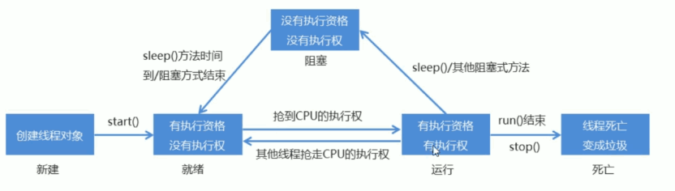

# Java 高级特性与实战基础

## File

**File 概述**

- **定义**：是文件和文件夹的路径的抽象表示。
- **特性**：对于 File 而言，其封装的不是真正存在的文件，仅仅是一个路径名，它可以存在也可以不存在。
- **作用**：将来通过具体操作把这个路径内存转为具体存在。

**构造方法**

| 方法名                              | 说明                                                         |
| :---------------------------------- | :----------------------------------------------------------- |
| `File(String pathname)`             | 通过将给定的路径名字符串转换为抽象路径名来创建新的 File 实例 |
| `File(String parent, String child)` | 从父路径名字符串和子路径名字符串创建新的 File 实例           |
| `File(File parent, String child)`   | 从父抽象路径名和子路径名字符串创建新的 File 实例             |

---

**File 类各功能方法**

1. 创建功能

| 方法名                           | 说明                                                             |
| :------------------------------- | :--------------------------------------------------------------- |
| `public boolean createNewFile()` | 当具有该名称的文件不存在时，创建一个由该抽象路径名命名的新空文件 |
| `public boolean mkdir()`         | 创建由此抽象路径名命名的目录                                     |
| `public boolean mkdirs()`        | 创建由此抽象路径名命名的目录，包括任何必需但不存在的父目录       |

> **eg**: 创建 File 对象后，调用这些方法会创建对应文件或文件夹，并返回 true，如已存在文件，则返回 false。

```java
File f1 = new File("C:\\Users\\小陈儿\\Desktop\\aspose\\java.txt");
System.out.println(f1.createNewFile());
File f2 = new File("C:\\Users\\小陈儿\\Desktop\\aspose\\mulu");
System.out.println(f2.mkdir());
File f3 = new File("C:\\Users\\小陈儿\\Desktop\\aspose\\多级\\里级");
System.out.println(f3.mkdirs());
```

2. File 类判断和获取功能

| 方法名                            | 说明                                                     |
| :-------------------------------- | :------------------------------------------------------- |
| `public boolean isDirectory()`    | 测试此抽象路径名表示的 File 是否为目录                   |
| `public boolean isFile()`         | 测试此抽象路径名表示的 File 是否为文件                   |
| `public boolean exists()`         | 测试此抽象路径名表示的 File 是否存在                     |
| `public String getAbsolutePath()` | 返回此抽象路径名的绝对路径名字符串                       |
| `public String getPath()`         | 将此抽象路径名转换为路径名字符串                         |
| `public String getName()`         | 返回由此抽象路径名表示的文件或目录的名称                 |
| `public String[] list()`          | 返回此抽象路径名表示的目录中的文件和目录的名称字符串数组 |
| `public File[] listFiles()`       | 返回此抽象路径名表示的目录中的文件和目录的 File 对象数组 |

3. File 删除功能

| 方法名                    | 说明                               |
| :------------------------ | :--------------------------------- |
| `public boolean delete()` | 删除由此抽象路径名表示的文件或目录 |

> **注意**：删除目录前，必须删除目录中的所有文件；添加文件前，要保证父目录存在。

## IO 流

### 概述

- **I/O**：输入输出。
- **流**：抽象概念，数据传输的总称；数据在设备间传输也称为流。
- **IO 流的作用**：就是处理设备间数据传输的，如文件复制、上传、下载。

**IO 流分类**

1.  **按数据流向分**：为输入流（读数据）和输出流（写数据）。
2.  **按数据类型分**：为字节流和字符流（Window 记事本能打开的就是用字符流，其他是字节流）。

### 字节流

- **字节流**
  - **字节输入流 (InputStream)**
    - FileInputStream
    - BufferedInputStream
  - **字节输出流 (OutputStream)**
    - FileOutputStream
    - BufferedOutputStream

**小结**：字节流可以复制任意文件数据，有4种方式，一般采用字节缓冲流一次读写一个字节数组的方式。  
**InputStream**：这个抽象类是表示字节输入流的所有类的超类。  
**OutputStream**：这个抽象类是表示字节输出流的所有类的超类。  
**子类名特点**：子类名称都是以其父类名作为子类名的后缀。

#### 字节流写数据

- **FileOutputStream**：文件输出流将数据写入文件。

```java
//这里做了3步操作 1) 调用系统功能创建文件 2) 创建字节输出流对象 3) 让对象指向文件
FileOutputStream fos = new FileOutputStream("idea_test//hello.txt");

//将指定字节写入此文件输出流
fos.write(98);

//也可写入多个字节
//byte[] bys = {97, 98, 99};
//fos.write(bys);

//释放资源
fos.close();
```

::: info 写入的3种方式

| 方法名                                   | 说明                                                                                           |
| :--------------------------------------- | :--------------------------------------------------------------------------------------------- |
| `void write(int b)`                      | 将指定的字节写入此文件输出流一次写一个字节数据                                                 |
| `void write(byte[] b)`                   | 将 b.length 字节从指定的字节数组写入此文件输出流一次写一个字节数组数据                         |
| `void write(byte[] b, int off, int len)` | 将 len 字节从指定的字节数组开始，从偏移量 off 开始写入此文件输出流一次写一个字节数组的部分数据 |

:::

- **补充**：字符串转换成对应的字节数组，`byte[] bys = "abcde".getBytes();`

---

::: info 字节流写数据的两个小问题

**1. 字节流写数据如何实现换行呢？**
写完数据后，加换行符：

- Windows: `\r\n`
- Linux: `\n`
- Mac: `\r`

**2. 字节流写数据如何实现追加写入呢？**

- `public FileOutputStream(String name, boolean append)`
- 创建文件输出流以指定的名称写入文件。如果第二个参数为 true，则字节将写入文件的末尾而不是开头。

```java
//写数据
for (int i = 0; i < 10; i++) {
    fos.write("hello".getBytes());
    fos.write("\r\n".getBytes());
}
```

:::

::: info 字节流写数据加异常处理

- **finally**：在异常处理时提供 finally 块来执行所有清除操作。比如说 IO 流中的释放资源。
- **特点**：被 finally 控制的语句一定会执行，除非 JVM 退出。

**标准格式：**

```java
try {
    可能出现异常的代码;
} catch (异常类名 变量名) {
    异常的处理代码;
} finally {
    执行所有清除操作;
}
```

**代码示例（加入 finally 来实现释放资源）：**

```java
FileOutputStream fos = null;
try {
    fos = new FileOutputStream(name: "myByteStream\\fos.txt");
    fos.write("hello".getBytes());
} catch (IOException e) {
    e.printStackTrace();
} finally {
    if (fos != null) {
        try {
            fos.close();
        } catch (IOException e) {
            e.printStackTrace();
        }
    }
}
```

:::

#### 字节流读数据

**FileInputStream**：从系统文件读取数据。

1. 一次读一个字节

```java
//这里打开实际文件的连接 创建了字节输入流对象，
FileInputStream fis = new FileInputStream("idea_test//hello.txt");

//调用字节输入流的read方法 返回1个字节的int值，找不到会返回-1
int read = fis.read();
System.out.println(read);
fis.close();
```

2. 一次读一个字节方式读文件的标准写法

```java
int by;
/*
    fis.read(): 读数据
    by=fis.read(): 把读取到的数据赋值给by
    by != -1: 判断读取到的数据是否是-1
*/
while ((by=fis.read())!=-1) {
    System.out.print((char)by);
}
```

3. 一次读取多个字节

**基础示例：**

```java
FileInputStream fis = new FileInputStream("idea_test//hello.txt");
//创建字节数组
byte[] cs = new byte[5];
//传入数组，数据会进入此数组，并返回实际存入的数量
int len = fis.read(cs);
System.out.println(new String(cs));
```

**标准循环读取示例：**

```java
byte[] bys = new byte[1024]; //1024及其整数倍
int len;
while ((len=fis.read(bys))!=-1) {
    System.out.print(new String(bys, 0, len));
}
```

#### 字节缓冲流

- **BufferedInputStream**：输入缓冲流，内部有缓冲数组。
- **BufferedOutputStream**：输出缓冲流，这种流可以写入字节，但又不直接调系统底层。
- **原理说明**：字节缓冲流仅仅提供缓冲区，真正读写数据还是要普通的字节流对象。

```java
//两种缓冲流都要传入基本的字节流对象

BufferedInputStream fis = new BufferedInputStream(new FileInputStream("C:\\Users\\小陈儿\\Desktop\\aspose\\code.mp4"));
BufferedOutputStream fos = new BufferedOutputStream(new FileOutputStream("idea_test\\code.mp4"));

byte[] bys = new byte[1024];
int len;
while ((len = fis.read(bys)) != -1) {
    fos.write(bys, 0, len);
}

fis.close();
fos.close();
```

### 字符流

- **字符流**
  - **字符输入流 (Reader)**
    - InputStreamReader
      - FileReader
    - BufferedReader
      - _特有功能_：`String readLine()` —— 一次读取一个字符串
  - **字符输出流 (Writer)**
    - OutputStreamWriter
      - FileWriter
    - BufferedWriter
      - _特有功能_：`void newLine()` —— 写一个换行符；`void write(String line)` —— 一次写一个字符串

> **小结**：字符流只能复制文本数据，有5种方式，一般采用字符缓冲流的特有功能。

::: info 为什么会出现字符流

- 由于字节流操作中文不是特别的方便，所以Java就提供字符流。
- **公式**：字符流 = 字节流 + 编码表
- **原理解析**：用字节流复制文本文件时，文本文件也会有中文，但是没有问题，原因是最终底层操作会自动进行字节拼接成中文。
  - _如何识别是中文的呢？_ 汉字在存储的时候，无论选择哪种编码存储，第一个字节都是负数。

:::

::: info 编码表

**基础知识：**

- 计算机中储存的信息都是用**二进制数**表示的；我们在屏幕上看到的英文、汉字等字符是二进制数转换之后的结果。
- 按照某种规则，将字符存储到计算机中，称为**编码**。反之，将存储在计算机中的二进制数按照某种规则解析显示出来，称为**解码**。这里强调一下：按照A编码存储，必须按照A编码解析，这样才能显示正确的文本符号，否则就会导致乱码现象。
- **字符编码**：就是一套自然语言的字符与二进制数之间的对应规则(A-65)。

**字符集：**

- 是一个系统支持的所有字符的集合，包括各国家文字、标点符号、图形符号、数字等。
- 计算机要准确的存储和识别各种字符集符号，就需要进行字符编码，一套字符集必然至少有一套字符编码。常见字符集有ASCII字符集、GBXXX字符集、Unicode字符集等。

**ASCII字符集：**

- **ASCII** (American Standard Code for Information Interchange, 美国信息交换标准代码)：是基于拉丁字母的一套电脑编码系统，用于显示现代英语，主要包括控制字符(回车键、退格、换行键等)和可显示字符(英文大小写字符、阿拉伯数字和西文符号)。
- 基本的ASCII字符集，使用7位表示一个字符，共128字符。ASCII的扩展字符集使用8位表示一个字符，共256字符，方便支持欧洲常用字符。是一个系统支持的所有字符的集合，包括各国家文字、标点符号、图形符号、数字等。

**GBXXX字符集：**

- **GB2312**：简体中文码表。一个小于127的字符的意义与原来相同，但两个大于127的字符连在一起时，就表示一个汉字，这样大约可以组合了包含7000多个简体汉字，此外数学符号、罗马希腊的字母、日文的假名等都编进去了，连在ASCII里本来就有的数字、标点、字母都统统重新编了两个字节长的编码，这就是常说的"全角"字符，而原来在127号以下的那些就叫"半角"字符了。
- **GBK**：最常用的中文码表。是在GB2312标准基础上的扩展规范，使用了双字节编码方案，共收录了21003个汉字，完全兼容GB2312标准，同时支持繁体汉字以及日韩汉字等。
- **GB18030**：最新的中文码表。收录汉字70244个，采用多字节编码，每个字可以由1个、2个或4个字节组成。支持中国国内少数民族的文字，同时支持繁体汉字以及日韩汉字等。

**Unicode字符集：**

- 为表达任意语言的任意字符而设计，是业界的一种标准，也称为统一码、标准万国码。它最多使用4个字节的数字来表达每个字母、符号，或者文字。有三种编码方案，UTF-8、UTF-16和UTF32。最为常用的UTF-8编码。
- **UTF-8编码**：可以用来表示Unicode标准中任意字符，它是电子邮件、网页及其他存储或传送文字的应用中，优先采用的编码。互联网工程工作小组（IETF）要求所有互联网协议都必须支持UTF-8编码。它使用一至四个字节为每个字符编码。
  - _编码规则_：
    - 128个US-ASCII字符，只需一个字节编码
    - 拉丁文等字符，需要二个字节编码
    - 大部分常用字（含中文），使用三个字节编码
    - 其他极少使用的Unicode辅助字符，使用四字节编码

> **小结**：采用何种规则编码，就要采用对应规则解码，否则就会出现乱码。

:::

#### 字符串编码解码操作

1. 编码
   - `byte[] getBytes()`：使用平台的默认字符集将该 String 编码为一系列字节，将结果存储到新的字节数组中。
   - `byte[] getBytes(String charsetName)`：使用指定的字符集将该 String 编码为一系列字节，将结果存储到新的字节数组中。

2. 解码
   - `String(byte[] bytes)`：通过使用平台的默认字符集解码指定的字节数组来构造新的 String。
   - `String(byte[] bytes, String charsetName)`：通过指定的字符集解码指定的字节数组来构造新的 String。

#### 字符流编码解码操作

1. 字符流抽象基类
   - **Reader**：字符输入流的抽象类。
   - **Writer**：字符输出流的抽象类。

2. 字符流中和编码解码问题相关的两个类
   - `InputStreamReader`
   - `OutputStreamWriter`

::: info OutputStreamWriter

- **定义**：是字符流通向字节流的桥梁，使用指定编码将写入字符编码为字节。

```java
//这里使用 GBK 编码将字符->字节
OutputStreamWriter osw = new OutputStreamWriter(new FileOutputStream("idea_test\\java.txt"), "GBK");
osw.write("写入");
osw.close();
```

**写入的 5 种方式：**

| 方法签名                                    | 说明                 |
| :------------------------------------------ | :------------------- |
| `void write(int c)`                         | 写一个字符           |
| `void write(char[] cbuf)`                   | 写入一个字符数组     |
| `void write(char[] cbuf, int off, int len)` | 写入字符数组的一部分 |
| `void write(String str)`                    | 写一个字符串         |
| `void write(String str, int off, int len)`  | 写一个字符串的一部分 |

**OutputStreamWriter 的两个常用方法：**

| 方法名    | 说明                                                                 |
| :-------- | :------------------------------------------------------------------- |
| `flush()` | 刷新流，还可以继续写数据                                             |
| `close()` | 关闭流，释放资源，但是在关闭之前会先刷新流。一旦关闭，就不能再写数据 |

:::

::: info OutputStreamWriter 和 Reader 子类：FileReader / FileWriter（上面的简化版本）

1. 转换流的名字比较长，而我们常见的操作都是按照本地默认编码实现的，所以，为了简化书写，转换流提供了对应的子类。
2. **FileReader**：用于读取字符文件的便捷类
   - `FileReader(String fileName)`
3. **FileWriter**：用于写入字符文件的便捷类
   - `FileWriter(String fileName)`

:::

::: info InputStreamReader

- **定义**：字节流通向字符流的桥梁，读取字节，使用指定编码将其解码为字符。

**读取的 2 种方式：**

| 方法名                  | 说明                   |
| :---------------------- | :--------------------- |
| `int read()`            | 一次读一个字符数据     |
| `int read(char[] cbuf)` | 一次读一个字符数组数据 |

```java
InputStreamReader isr = new InputStreamReader(new FileInputStream("idea_test\\java.txt"), "GBK");
char[] ss = new char[2];
isr.read(ss);
System.out.println(Arrays.toString(ss));
```

:::

#### 字符缓冲流

**概述：** 字符缓冲流和字节缓冲流用法相似。

**字符缓冲流介绍**

- **BufferedWriter**：将文本写入字符输出流，缓冲字符，以提供单个字符、数组和字符串的高效写入。可以指定缓冲区大小，或者可以接受默认大小。默认值足够大，可用于大多数用途。
- **BufferedReader**：从字符输入流读取文本，缓冲字符，以提供字符、数组和行的高效读取。可以指定缓冲区大小，或者可以使用默认大小。默认值足够大，可用于大多数用途。

**构造方法**

- `BufferedWriter(Writer out)`
- `BufferedReader(Reader in)`

**缓冲流的读一行和写换行方法**

```java
BufferedReader br = new BufferedReader(new FileReader("C:\\Users\\小陈儿\\Desktop\\javaA\\样例.txt"));
BufferedWriter bw = new BufferedWriter(new FileWriter("idea_test\\想写什么.txt"));

char[] str = new char[1024];
String len; // 注意：这里原图变量名定义为String类型，用于接收readLine()的返回值

while ((len = br.readLine()) != null) { // 读取一行数据，不会读取换行符
    bw.write(len);
    bw.newLine(); // 换行方法
}

bw.close();
br.close();
```

### 特殊操作流

#### 标准输入输出流

System类中有两个静态的成员变量：

- `public static final InputStream in`：标准输入流。通常该流对应于键盘输入或由主机环境或用户指定的另一个输入源。
- `public static final PrintStream out`：标准输出流。通常该流对应于显示输出或由主机环境或用户指定的另一个输出目标。

**自己实现键盘录入数据：**

- `BufferedReader br = new BufferedReader(new InputStreamReader(System.in));`

写起来太麻烦，Java就提供了一个类实现键盘录入：

- `Scanner sc = new Scanner(System.in);`

**输出语句的本质：** 是一个标准的输出流

- `PrintStream ps = System.out;`
- PrintStream类有的方法，System.out都可以使用。

#### 打印流

**打印流分类：**

- **字节打印流**：`PrintStream`
- **字符打印流**：`PrintWriter`

**打印流的特点：**

- 只负责输出数据，不负责读取数据。
- 有自己的特有方法。

**字节打印流 (`PrintStream`)：**

- `PrintStream(String fileName)`：使用指定的文件名创建新的打印流。
- 使用继承父类的方法写数据，查看的时候会转码；使用自己的特有方法写数据，查看的数据原样输出。

**字符打印流 (`PrintWriter`) 的构造方法：**

| 方法名                                       | 说明                                                                                                                                            |
| :------------------------------------------- | :---------------------------------------------------------------------------------------------------------------------------------------------- |
| `PrintWriter(String fileName)`               | 使用指定的文件名创建一个新的PrintWriter，而不需要自动执行刷新。                                                                                 |
| `PrintWriter(Writer out, boolean autoFlush)` | 创建一个新的PrintWriter。• **out**：字符输出流• **autoFlush**：一个布尔值，如果为真，则 `println`，`printf`，或 `format` 方法将刷新输出缓冲区。 |

#### 对象序列化流

**对象序列化**：将对象保存到磁盘中，或者在网络中传输对象。  
这种机制就是用一个字节序列表示一个对象，该字节序列包含对象类型、数据、属性等；字节序列写入文件后，相当于文件中保存的对象信息。  
反之，可以从文件中读取该字节序列，重构对象，对其进行反序列化。

- **对象序列化流**：`ObjectOutputStream`
- **对象反序列化**：`ObjectInputStream`

::: info 序列化例子：java 对象 -> 文件

```java
ObjectOutputStream oos = new ObjectOutputStream(new FileOutputStream("idea_test/java.txt"));
//此对象被序列化，需要实现 Serializable 接口
Ser s1 = new Ser("eve");
//序列化方法，将对象写入
oos.writeObject(s1);
oos.close();
```

::: warning ⚠️ 注意

- 一个对象要想被序列化，该对象所属的类必须必须实现 **Serializable** 接口。
- Serializable 是一个**标记接口**，实现该接口不需要重写任何方法。

:::

::: info 反序列化：文件内容 -> java 对象

```java
ObjectInputStream ois = new ObjectInputStream(new FileInputStream("idea_test/java.txt"));
Object Obj = ois.readObject();
Ser s2 = (Ser)Obj;
System.out.println(s2.getName());
```

:::

::: tip 常见问题与解决

1.  **用对象序列化流序列化了一个对象后，假如我们修改了对象所属的类文件，读取数据会不会出问题呢？**
    - 会出问题，抛出 `InvalidClassException` 异常。

2.  **如果出问题了，如何解决呢？**
    - 给对象所属的类加一个 `serialVersionUID`
      ```java
      private static final long serialVersionUID = 42L;
      ```

3.  **如果一个对象中的某个成员变量的值不想被序列化，又该如何实现呢？**
    - 给该成员变量加 **transient** 关键字修饰，该关键字标记的成员变量不参与序列化过程。

:::

#### Properties

- 是一个 MAP 体系的集合类。
- Properties 可以保存到流中或从流中加载。
- 能用 map 的方法，也有特有的添加获取方法。

**Properties 特有方法**

| 方法名                                         | 说明                                                             |
| :--------------------------------------------- | :--------------------------------------------------------------- |
| `Object setProperty(String key, String value)` | 设置集合的键和值，都是String类型，底层调用Hashtable方法 put      |
| `String getProperty(String key)`               | 使用此属性列表中指定的键搜索属性                                 |
| `Set<String> stringPropertyNames()`            | 从该属性列表中返回一个不可修改的键集，其中键及其对应的值是字符串 |

**流相关操作方法**

| 方法名                                          | 说明                                                                                                    |
| :---------------------------------------------- | :------------------------------------------------------------------------------------------------------ |
| `void load(InputStream inStream)`               | 从输入字节流读取属性列表（键和元素对）                                                                  |
| `void load(Reader reader)`                      | 从输入字符流读取属性列表（键和元素对）                                                                  |
| `void store(OutputStream out, String comments)` | 将此属性列表（键和元素对）写入此 Properties表中，以适合于使用 load(InputStream)方法的格式写入输出字节流 |
| `void store(Writer writer, String comments)`    | 将此属性列表（键和元素对）写入此 Properties表中，以适合于使用 load(Reader)方法的格式写入输出字符流      |

## 线程

**进程：**

- 正在运行的程序。
- 是系统进行资源分配和调用的独立单位。
- 每一个进程都有它自己的内存空间和系统资源。

**线程：**

- 是进程中的单个顺序控制流，是一条执行路径。

### 多线程实现方式一：继承 Thread 类

**基本步骤：**

- 定义一个类继承 `Thread` 类，重写 `run` 方法。
- 创建此类对象，启动线程。

**注意：**

- `run` 方法中是封装被线程执行的代码。
- 对象的 `start()` 方法：启动线程；再直接调用 `run` 是普通调用。

**Thread 类中设置和获取线程名的方法：**

- **设置：** `void setName(String name)`; 也可通过构造函数设置名称。
- **获取：** `String getName()`;
- **获取 main() 方法所在的线程：** `public static Thread currentThread()` 返回当前正在执行线程的引用。

::: info 线程优先级

**线程有两种调度模型：**

1.  **分时调度模型：** 所有线程平均使用 CPU 的使用权，平均分配每个线程占用 CPU 时间片。
2.  **抢占式调度模型：** 让优先级高的线程使用 CPU，优先级相同就随机。
    - Java 使用的是抢占式模型。

**Thread 类的获取和设置优先级：**

- `public final int getPriority()`
- `public final void setPriority(int newPriority)`

:::

::: info 线程控制

| 方法名                           | 说明                                                                 |
| :------------------------------- | :------------------------------------------------------------------- |
| `static void sleep(long millis)` | 使当前正在执行的线程停留（暂停执行）指定的毫秒数                     |
| `void join()`                    | 等待这个线程死亡                                                     |
| `void setDaemon(boolean on)`     | 将此线程标记为守护线程，当运行的线程都是守护线程时，Java虚拟机将退出 |

:::

::: info 线程生命周期

**注意：** 线程在执行过程中会被其他线程抢走执行权。


:::

### 线程实现方式二：实现 Runnable 接口

**实现 Runnable 接口**

- 定义一个类 `MyRunnable` 实现 `Runnable` 接口。
- 在 `MyRunnable` 类中重写 `run()` 方法。
- 创建 `MyRunnable` 类的对象。
- 创建 `Thread` 类的对象，把 `MyRunnable` 对象作为构造方法的参数。
- 启动线程。

**多线程的实现方案有两种：**

- 继承 `Thread` 类。
- 实现 `Runnable` 接口。

**相比继承 Thread 类，实现 Runnable 接口的好处：**

- 避免了 Java 单继承的局限性。
- 适合多个相同程序的代码去处理同一个资源的情况，把线程和程序的代码、数据有效分离，较好的体现了面向对象的设计思想。

```java
MyRunnable mt = new MyRunnable(); // 创建此类对象
Thread t1 = new Thread(mt, "龙卷风"); // 创建Thread对象并把此类传入
t1.start();
```

### 多线程的安全问题及解决

**出现问题原因：** 有共享数据，数据被多条语句操作了。
**解决：** 同步代码。

**同步代码**

锁多条语句操作共享数据，使用同步代码块实现。

格式：

```java
synchronized(任意对象){
    多条语句操作共享数据的代码
}
```

这就相当于给代码加锁了，任意对象就可以看成一把锁。

> 同步好处和弊端：
>
> **优点：** 解决了线程安全问题。  
> **缺点：** 当线程过多时，每个线程都会去判断同步上的锁，耗费性能。

**同步方法**

普通方法直接加上 `synchronized` 关键字，锁对象为 `this`。  
静态方法也直接加上 `synchronized`，锁对象时类名.class。

**Lock 锁**

Lock 提供了获得锁和释放锁的方法：

- `void lock()`: 获得锁
- `void unlock()`: 释放锁

Lock 是一个接口不能直接实例化，采用它的实现类 `ReentrantLock` 来创建。

::: info 线程安全的类

**StringBuffer**

- 线程安全，可变的字符序列。
- 从版本JDK 5开始，被 `StringBuilder` 替代。通常应该使用 `StringBuilder` 类，因为它支持所有相同的操作，但它更快，因为它不执行同步。

**Vector**

- 从Java 2平台v1.2开始，该类改进了List接口，使其成为Java Collections Framework的成员。与新的集合实现不同，Vector被同步。如果不需要线程安全的实现，建议使用 `ArrayList` 代替 `Vector`。

**Hashtable**

- 该类实现了一个哈希表，它将键映射到值。任何非null对象都可以用作键或者值。
- 从Java 2平台v1.2开始，该类进行了改进，实现了Map接口，使其成为Java Collections Framework的成员。与新的集合实现不同，Hashtable被同步。如果不需要线程安全的实现，建议使用 `HashMap` 代替 `Hashtable`。

:::

### 生产者消费者

主要是包含了两类线程：

- **生产者线程**用于产生数据。
- **消费者线程**用于消费数据。
- 数据放在公共的仓库中。

消费和生产过程中的等待和唤醒方法，这些方法都在 `Object` 类中。

| 方法名             | 说明                                                                              |
| :----------------- | :-------------------------------------------------------------------------------- |
| `void wait()`      | 导致当前线程等待，直到另一个线程调用该对象的 `notify()` 方法或 `notifyAll()` 方法 |
| `void notify()`    | 唤醒正在等待对象监视器的单个线程                                                  |
| `void notifyAll()` | 唤醒正在等待对象监视器的所有线程                                                  |

## 网络编程

::: info 网络编程三要素

1. IP地址
   - 要想让网络中的计算机能够互相通信，必须为每台计算机指定一个标识号，通过这个标识号来指定要接收数据的计算机和识别发送的计算机，而IP地址就是这个标识号。也就是设备的标识。

2. 端口
   - 网络的通信，本质上是两个应用程序的通信。每台计算机都有很多的应用程序，那么在网络通信时，如何区分这些应用程序呢？如果说IP地址可以唯一标识网络中的设备，那么端口号就可以唯一标识设备中的应用程序了。也就是应用程序的标识。

3. 协议
   - 通过计算机网络可以使多台计算机实现连接，位于同一个网络中的计算机在进行连接和通信时需要遵守一定的规则，这就好比在道路中行驶的汽车一定要遵守交通规则一样。在计算机网络中，这些连接和通信的规则被称为网络通信协议，它对数据的传输格式、传输速率、传输步骤等做了统一规定，通信双方必须同时遵守才能完成数据交换。常见的协议有UDP协议和TCP协议。

:::

### IP 地址

**IP地址：** 是网络中设备的唯一标识。

**IP地址分为两大类：**

- **IPv4：** 是给每个连接在网络上的主机分配一个32bit地址。按照TCP/IP规定，IP地址用二进制来表示，每个IP地址长32bit，也就是4个字节。例如一个采用二进制形式的IP地址是“11000000 10101000 00000001 01000010”，这么长的地址，处理起来也太费劲了。为了方便使用，IP地址经常被写成十进制的形式，中间使用符号“.”分隔不同的字节。于是，上面的IP地址可以表示为“192.168.1.66”。IP地址的这种表示法叫做“点分十进制表示法”，这显然比1和0容易记忆得多。
- **IPv6：** 由于互联网的蓬勃发展，IP地址的需求量愈来愈大，但是网络地址资源有限，使得IP的分配越发紧张。为了扩大地址空间，通过IPv6重新定义地址空间，采用128位地址长度，每16个字节一组，分成8组十六进制数，这样就解决了网络地址资源数量不够的问题。

**常用命令：**

- `ipconfig`：查看本机IP地址。
- `ping IP地址`：检查网络是否连通。

**特殊IP地址：**

- `127.0.0.1`：是回送地址，可以代表本机地址，一般用来测试使用。

---

**InetAddress 的使用：**

为了方便我们对IP地址的获取和操作，Java提供了一个类 `InetAddress` 供我们使用。

**InetAddress：** 此类表示Internet协议（IP）地址。

| 方法名                                      | 说明                                                         |
| :------------------------------------------ | :----------------------------------------------------------- |
| `static InetAddress getByName(String host)` | 确定主机名称的IP地址。主机名称可以是机器名称，也可以是IP地址 |
| `String getHostName()`                      | 获取此IP地址的主机名                                         |
| `String getHostAddress()`                   | 返回文本显示中的IP地址字符串                                 |

### 端口

**端口：** 设备上应用程序的唯一标识。

**端口号：** 用两个字节表示的整数，它的取值范围是0~65535。其中，0~1023之间的端口号用于一些知名的网络服务和应用，普通的应用程序需要使用1024以上的端口号。如果端口号被另外一个服务或应用所占用，会导致当前程序启动失败。

### 协议

**协议：** 计算机网络中，连接和通信的规则被称为网络通信协议。

::: info UDP协议

- **用户数据报协议 (User Datagram Protocol)**
- UDP是**无连接**通信协议，即在数据传输时，数据的发送端和接收端不建立逻辑连接。简单来说，当一台计算机向另外一台计算机发送数据时，发送端不会确认接收端是否存在，就会发出数据，同样接收端在收到数据时，也不会向发送端反馈是否收到数据。
- 由于使用UDP协议消耗资源小，通信效率高，所以通常都会用于音频、视频和普通数据的传输。
- 例如视频会议通常采用UDP协议，因为这种情况即使偶尔丢失一两个数据包，也不会对接收结果产生太大影响。但是在使用UDP协议传送数据时，由于UDP的面向无连接性，不能保证数据的完整性，因此在传输重要数据时不建议使用UDP协议。

:::

::: info TCP协议

- **传输控制协议 (Transmission Control Protocol)**
- TCP协议是**面向连接**的通信协议，即传输数据之前，在发送端和接收端建立逻辑连接，然后再传输数据，它提供了两台计算机之间**可靠无差错**的数据传输。在TCP连接中必须要明确客户端与服务器端，由客户端向服务端发出连接请求，每次连接的创建都需要经过“三次握手”。
- **三次握手：** TCP协议中，在发送数据的准备阶段，客户端与服务器之间的三次交互，以保证连接的可靠。
  - 第1次握手，客户端向服务器端发出连接请求，等待服务器确认。
  - 第2次握手，服务器端向客户端回送一个响应，通知客户端收到了连接请求。
  - 第3次握手，客户端再次向服务器端发送确认信息，确认连接。
- 完成三次握手，连接建立后，客户端和服务器就可以开始进行数据传输了。由于这种面向连接的特性，TCP协议可以保证传输数据的安全，所以应用十分广泛。例如上传文件、下载文件、浏览网页等。

:::

#### UDP

::: info UDP 发送数据的步骤

1.  **创建发送端的Socket对象 (DatagramSocket)**
    - `DatagramSocket()`
2.  **创建数据，并把数据打包**
    - `DatagramPacket(byte[] buf, int length, InetAddress address, int port)`
3.  **调用DatagramSocket对象的方法发送数据**
    - `void send(DatagramPacket p)`
4.  **关闭发送端**
    - `void close()`

:::

```java
// 创建发送端 socket 对象
DatagramSocket ds = new DatagramSocket();
// 创建数组，准备要发送的数据
byte[] b = "你好哦，我要发送 udp 数据".getBytes();
// 准备数据包，传入数组，长度，InetAddress 对象，端口号
DatagramPacket dp = new DatagramPacket(b, b.length, InetAddress.getByName("LAPTOP-SHFG5HPP"), 1045);
// 调用 socket send 方法，传入数据包
ds.send(dp);
// 关闭
ds.close();
```

---

::: info UDP 接收数据的步骤

1.  **创建接收端的Socket对象 (DatagramSocket)**
    - `DatagramSocket(int port)`
2.  **创建一个数据包，用于接收数据**
    - `DatagramPacket(byte[] buf, int length)`
3.  **调用DatagramSocket对象的方法接收数据**
    - `void receive(DatagramPacket p)`
4.  **解析数据包，并把数据在控制台显示**
    - `byte[] getData()`
    - `int getLength()`
5.  **关闭接收端**
    - `void close()`

:::

```java
// 创建接收 socket 对象，并指定端口
DatagramSocket ds = new DatagramSocket(1045);
// 创建数组接收数据
byte[] bys = new byte[1024];
// 创建数据包 传入数组和长度
DatagramPacket dp = new DatagramPacket(bys, bys.length);
// 调用 socket 方法接收数据
ds.receive(dp);
// 解析数据包
byte[] datas = dp.getData();
// 获取数据实际长度
int len = dp.getLength();
System.out.println(new String(datas, 0, len));
ds.close();
```

#### TCP

::: info TCP 发送数据的步骤

1.  **创建客户端的Socket对象 (Socket)**
    - `Socket(String host, int port)`
2.  **获取输出流，写数据**
    - `OutputStream getOutputStream()`
3.  **释放资源**
    - `void close()`

:::

```java
// 创建 socket 对象，传入 ip 和端口
Socket soc = new Socket("192.168.1.8", 10000);
// 获取输出流 写入数据
OutputStream os = soc.getOutputStream();
os.write("我是客户端，我要来了哦".getBytes());
// 接受服务器响应
InputStream is = soc.getInputStream();
byte[] bys = new byte[1024];
int len = is.read(bys);
System.out.println(new String(bys, 0, len));
// 关闭
soc.close();
```

---

::: info TCP 接收数据的步骤

1.  **创建服务器端的Socket对象 (ServerSocket)**
    - `ServerSocket(int port)`
2.  **监听客户端连接，返回一个Socket对象**
    - `Socket accept()`
3.  **获取输入流，读数据，并把数据显示在控制台**
    - `InputStream getInputStream()`
4.  **释放资源**
    - `void close()`

:::

```java
// 创建服务器端 socket 对象
ServerSocket ss = new ServerSocket(10000);
// 侦听连接到这个套接字并接受它
Socket soc = ss.accept();
// 获取输入流读取数据
InputStream is = soc.getInputStream();
byte[] bys = new byte[1024];
int len = is.read(bys);
System.out.println(new String(bys));
// 响应客户端
OutputStream os = soc.getOutputStream();
os.write("服务器收到了请求哦".getBytes());
ss.close();
```

## Lambda 表达式

::: info Lambda表达式的标准格式

**Lambda表达式的格式**

- **格式：** `(形式参数) -> {代码块}`
- **形式参数：** 如果有多个参数，参数之间用逗号隔开；如果没有参数，留空即可。
- **->：** 由英文中画线和大于符号组成，固定写法。代表指向动作。
- **代码块：** 是我们具体要做的事情，也就是以前我们写的方法体内容。

**省略规则：**

- 参数类型可以省略。但是有多个参数的情况下，不能只省略一个。
- 如果参数有且仅有一个，那么小括号可以省略。
- 如果代码块的语句只有一条，可以省略大括号和分号，甚至是 `return`。

**注意事项：**

- 使用Lambda必须要有接口，并且要求接口中有且仅有一个抽象方法。
- 必须有上下文环境，才能推导出Lambda对应的接口。
  - 根据**局部变量的赋值**得知Lambda对应的接口：`Runnable r = () -> System.out.println("Lambda表达式");`
  - 根据**调用方法的参数**得知Lambda对应的接口：`new Thread(() -> System.out.println("Lambda表达式")).start();`

:::

::: info Lambda表达式和匿名内部类的区别

**所需类型不同**

- **匿名内部类：** 可以是接口，也可以是抽象类，还可以是具体类。
- **Lambda表达式：** 只能是接口。

**使用限制不同**

- 如果接口中有且仅有一个抽象方法，可以使用Lambda表达式，也可以使用匿名内部类。
- 如果接口中多于一个抽象方法，只能使用匿名内部类，而不能使用Lambda表达式。

**实现原理不同**

- **匿名内部类：** 编译之后，产生一个单独的 `.class` 字节码文件。
- **Lambda表达式：** 编译之后，没有一个单独的 `.class` 字节码文件。对应的字节码会在运行的时候动态生成。

:::

## 函数式编程

### 方法引用

**概述：** 使用 Lambda 表达式时，实际上传入的代码是一种解决方案，如果其他地方有相同的方案就可通过方法引用来减少代码。  
**方法引用符：** `::` 为引用运算符；方法引用是 Lambda 表达式的孪生兄弟。

| 方法引用类型     | 格式               | 注意事项                                                |
| ---------------- | ------------------ | ------------------------------------------------------- |
| 引用类方法       | `类名::静态方法名` | Lambda 的形参会全部传入静态方法                         |
| 引用对象方法     | `对象名::成员方法` | Lambda 的形参会全部传入成员方法                         |
| 引用类的实例方法 | `类名::成员方法`   | Lambda 形参第一个参数是方法的调用者，后面才是方法的参数 |
| 引用构造器       | `类名::new`        | Lambda 的形参会全部传给构造器                           |

### 函数式接口

**概述：** 函数式接口就是只有一个抽象方法的接口，注解 `@FunctionalInterface`。

**函数中出现函数式接口的情况：**

- 方法参数是一个函数式接口，可用 Lambda 表达式。
- 返回值是一个函数式接口，可用 Lambda 表达式。

---

**常用函数式接口：**

**1. `Supplier<T>`:生产数据**

- 只有一个 `T get()` 方法，返回 Lambda 式中的参数。

```java
static Integer getMax(Supplier<Integer> sup) {
    return sup.get(); // 接收 L 表达式中的返回
}
```

- **Lambda 表达式中返回整数：**
  ```java
  int max = getMax(() -> 111);
  ```

**2. `Consumer<T>`:消费数据**

- `void accept(<T> t)` 方法：传入参数，由 Lambda 去操作。
- `andThen` 方法：返回一个组合的 Consumer。

  ```java
  public static void operatorString(Consumer<String> con) {
      con.accept("林青霞"); // 调用 accept 传入字符串
  }
  ```

- **直接在 Lambda 中使用这个数据：**
  ```java
  operatorString(s -> System.out.println(s));
  ```

**3. `Predicate<T>`:判断功能**

- **`Predicate<T>`:常用的四个方法**
  - `boolean test(T t)`：对给定的参数进行判断（判断逻辑由 Lambda 表达式实现），返回一个布尔值。
  - `default Predicate<T> negate()`：返回一个逻辑的否定，对应逻辑非。
  - `default Predicate<T> and(Predicate other)`：返回一个组合判断，对应短路与。
  - `default Predicate<T> or(Predicate other)`：返回一个组合判断，对应短路或。
- `Predicate<T>` 接口通常用于判断参数是否满足指定的条件。
- **用到 or 方法组合两个判断，再调用 test 获得结果：**
  ```java
  public static boolean checkString(Predicate<String> s1, Predicate<String> s2) {
      return s1.or(s2).test("字母啊");
  }
  ```
- **这里返回两个结果：**
  ```java
  System.out.println(checkString(s -> {
      return true;
  }, s2 -> {
      return false;
  }));
  ```

**4. `Function<T,R>`:函数接口**

- 接口表示接收一个参数 T 产生结果的函数 R。
- **`Function<T,R>`:常用的两个方法**
  - `R apply(T)`：将此函数应用于给定的参数。
  - `default <V> Function andThen(Function after)`：返回一个组合函数，首先将该函数应用于输入，然后将 after 函数应用于结果。
- `Function<T,R>` 接口通常用于对参数进行处理，转换（处理逻辑由 Lambda 表达式实现），然后返回一个新的值。
- **函数接收字符串，返回一个数值：**
  ```java
  private static void convert(String str, Function<String, Integer> fn) {
      int num = fn.apply(str);
      System.out.println(num);
  }
  ```
- **Lambda 中拿到字符串，返回数值：**
  ```java
  convert("345", str -> {
      return Integer.parseInt(str);
  });
  ```

### Stream 流

**概述：**

- Stream 流把真正的函数式编程，引入到 Java 中。
- Stream 流不是一种数据结构，不保存数据，它只是在原数据集上定义了一组操作。
- 直接阅读代码就能展示逻辑。
- 下列代码就是生成流，过滤两次，再逐一打印：
  `list.stream().filter(s->s.startsWith("张")).filter(s->s.length()>2).forEach(System.out::println);`

::: info Stream 流生成方式

要使用流就要先通过数据源（集合、数组）生成：

- **Collection体系的集合可以使用默认方法stream()生成流**
  - `default Stream<E> stream()`
- **Map体系的集合间接的生成流**
- **数组可以通过Stream接口的静态方法of(T... values)生成流**

:::

::: info Stream 流常见中间操作方法

生成流后通过中间操作做数据处理，生成新的流，给下一个操作使用：

- `Stream<T> filter(Predicate predicate)`：用于对流中的数据进行过滤
  - Predicate接口中的方法 `boolean test(T t)`：对给定的参数进行判断，返回一个布尔值
- `Stream<T> limit(long maxSize)`：返回此流中的元素组成的流，截取前指定参数个数的数据
- `Stream<T> skip(long n)`：跳过指定参数个数的数据，返回由该流的剩余元素组成的流
- `static <T> Stream<T> concat(Stream a, Stream b)`：合并a和b两个流为一个流
- `Stream<T> distinct()`：返回由该流的不同元素（根据Object.equals(Object)）组成的流
- `Stream<T> sorted()`：返回由此流的元素组成的流，根据自然顺序排序
- `Stream<T> sorted(Comparator comparator)`：返回由该流的元素组成的流，根据提供的Comparator进行排序
- `<R> Stream<R> map(Function mapper)`：返回由给定函数应用于此流的元素的结果组成的流
  - Function接口中的方法 `R apply(T t)`
- `IntStream mapToInt(ToIntFunction mapper)`：返回一个IntStream其中包含将给定函数应用于此流的元素的结果

:::

::: info Stream 流终结方法

流的最后一个操作：

- `void forEach(Consumer action)`：对此流的每个元素执行操作
  - Consumer接口中的方法 `void accept(T t)`：对给定的参数执行此操作
- `long count()`：返回此流中的元素数

:::

::: info Stream 收集操作

**概述：** 可把操作完的流放入集合中。
**收集操作具体步骤：** 调用流的 collect 方法，传入一个 Collector 接口方法（此接口由工具类提供）。

- `R collect(Collector collector)`
- 但是这个收集方法的参数是一个Collector 接口

**工具类Collectors提供了具体的收集方式：**

- `public static <T> Collector toList()`：把元素收集到List集合中
- `public static <T> Collector toSet()`：把元素收集到Set集合中
- `public static Collector toMap(Function keyMapper, Function valueMapper)`：把元素收集到Map集合中

**流生成 list**

```java
List<String> strList = Stream.of(str).collect(Collectors.toList());
System.out.println(strList);
```

**流生成 map**

```java
String[] strArr = {"林青霞,30", "张曼玉,35", "王祖贤,33", "刘岩,25"};
Stream<String> arrayStream = Stream.of(strArr).filter(s -> Integer.parseInt(s.split(",")[1]) > 28);
Map<String, String> mapString = arrayStream.collect(Collectors.toMap(s -> s.split(",")[0], s2 -> s2.split(",")[1]));
```

:::

## 反射

### 类加载器

**概述：**
负责将 class 文件加载到内存中，生成 `java.lang.Class` 对象。

**类加载器对象：** `ClassLoader`

**类加载机制：** 全盘负责、父类委托、缓存机制

**Java运行时具有以下内置类加载器：**

- **Bootstrap class loader：** 它是虚拟机的内置类加载器，通常表示为 `null`，并且没有父 `null`。
- **Platform class loader：** 平台类加载器可以看到所有平台类，平台类包括由平台类加载器或其祖先定义的 Java SE 平台 API，其实现类和 JDK 特定的运行时类。
- **System class loader：** 它也被称为应用程序类加载器，与平台类加载器不同。系统类加载器通常用于定义应用程序类路径，模块路径和 JDK 特定工具上的类。

### java 反射操作

**Java 反射机制：** 指在运行时获取一个类的变量和方法信息，通过获取到的信息创建对象，调用方法的一种机制。由于这种动态特性，可以极大的增强了程序的灵活性。

::: info 获取 Class 类对象

通过反射去使用一个类，要获取到该类字节码文件对象，就是类型为 Class 类型的对象。
有 3 种方式获取类型对象：

- **使用类的 class 属性来获取该类对应的 Class 对象。** 举例：`Student.class` 将会返回 `Student` 类对应的 `Class` 对象。
- **调用对象的 `getClass()` 方法，返回该对象所属类对应的 Class 对象。**
  - 该方法是 `Object` 类中的方法，所有的 Java 对象都可以调用该方法。
- **使用 Class 类中的静态方法 `forName(String className)`，该方法需要传入字符串参数，该字符串参数的值是某个类的全路径，也就是完整包名的路径。**

:::

::: info 获取构造并创建对象

`Constructor` 提供有关类的单个构造函数的信息和访问权限。

**Class 类中用于获取构造方法的方法：**

- `Constructor<?>[] getConstructors()`：返回所有公共构造方法对象的数组。
- `Constructor<?>[] getDeclaredConstructors()`：返回所有构造方法对象的数组。
- `Constructor<T> getConstructor(Class<?>... parameterTypes)`：返回单个公共构造方法对象。
- `Constructor<T> getDeclaredConstructor(Class<?>... parameterTypes)`：返回单个构造方法对象。

**Constructor 类中用于创建对象的方法：**

- `T newInstance(Object... initargs)`：根据指定的构造方法创建对象。

```java
// 获取类对象
Class<?> c = Person.class;
// 获取指定参数构造函数对象
Constructor<?> con = c.getConstructor(String.class, int.class);
// 创建对象
Object obj = con.newInstance("陈彦明", 22);
```

**注意：** 如果获取的是私有构造函数可通过 Constructor 对象的 `setAccessible` 方法取消检查。
`con.setAccessible(true);`

:::

::: info 反射获取成员变量

`Field` 提供有关类或接口的单个字段的信息和动态访问。

**Class 类中用于获取成员变量的方法：**

- `Field[] getFields()`：返回所有公共成员变量对象的数组。
- `Field[] getDeclaredFields()`：返回所有成员变量对象的数组。
- `Field getField(String name)`：返回单个公共成员变量对象。
- `Field getDeclaredField(String name)`：返回单个成员变量对象。

**Field 类中用于给成员变量赋值的方法：**

- `void set(Object obj, Object value)`：给 obj 对象的成员变量赋值为 value。

```java
Class<?> c = Person.class;
Constructor<?> con = c.getConstructor();
Object obj = con.newInstance();
// 通过方法传入名称拿到 Field 对象
Field fname = c.getDeclaredField("name");
// 因为是私有，要设置一下
fname.setAccessible(true);
// 给 obj 成员变量赋值
fname.set(obj, "cyp");
```

:::

::: info 反射获取成员方法

`Method` 提供有关类或接口上的单个方法的信息和访问权限。

**Class 类中用于获取成员方法的方法：**

- `Method[] getMethods()`：返回所有公共成员方法对象的数组，包括继承的。
- `Method[] getDeclaredMethods()`：返回所有成员方法对象的数组，不包括继承的。
- `Method getMethod(String name, Class<?>... parameterTypes)`：返回单个公共成员方法对象。
- `Method getDeclaredMethod(String name, Class<?>... parameterTypes)`：返回单个成员方法对象。

**Method 类中用于调用成员方法的方法：**

- `Object invoke(Object obj, Object... args)`：调用 obj 对象的成员方法，参数是 args，返回值是 Object 类型。

```java
Class<?> c = Person.class;
Constructor<?> con = c.getConstructor();
Object obj = con.newInstance();
// 获取方法，并设置好参数
Method m = c.getMethod("sayHi", String.class);
// 通过 invoke 调用方法，并传入参数，接收返回值（默认为 Obj）
Object b1 = m.invoke(obj, "我是换行");
System.out.println(b1);
```

:::

::: info 反射越过泛型检查

**eg:** 通过反射往一个 `ArrayList<Integer>` 中添加了字符串和数字。

```java
ArrayList<Integer> array = new ArrayList<>();
Class<? extends ArrayList> c = array.getClass();
Method m = c.getMethod("add", Object.class);
m.invoke(array, "hello");
m.invoke(array, "world");
m.invoke(array, 123);
System.out.println(array);
```

:::

## 补充知识

### 模块

#### 模块的基本使用

**模块的基本使用步骤：**

- 创建模块（按照以前的讲解方式创建模块，创建包，创建类，定义方法）。
- 为了体现模块的使用，我们创建 2 个模块，一个是 `myOne`，一个是 `myTwo`。
- 在模块的 `src` 目录下新建一个名为 `module-info.java` 的描述性文件，该文件专门定义模块名，访问权限，模块依赖等信息。
- 描述性文件中使用模块导出和模块依赖来进行配置并使用。
- 模块中所有未导出的包都是模块私有的，他们是不能在模块之外被访问的。
  - 在 `myOne` 这个模块下的描述性文件中配置模块导出。
  - **模块导出格式：** `exports 包名;`
- 一个模块要访问其他的模块，必须明确指定依赖哪些模块，未明确指定依赖的模块不能访问。
  - 在 `myTwo` 这个模块下的描述性文件中配置模块依赖。
  - **模块依赖格式：** `requires 模块名;`
  - **注意：** 写模块名报错，需要按下 `Alt + Enter` 提示，然后选择模块依赖。
- 在 `myTwo` 这个模块的类中使用依赖模块下的内容。

#### 模块服务的应用

**服务：** 从 Java 6 开始，Java 提供了一种服务机制，允许服务提供者和使用者之间完成解耦。简单的说，就是服务使用者只面向接口编程，但不清楚服务提供者的实现类。

Java 9 的模块化系统则进一步的简化了 Java 的服务机制。Java 9 允许将服务接口定义在一个模块中，并使用 `uses` 语句来声明该服务接口，然后针对该服务接口提供不同的服务实现类，这些服务实现类可以分布在不同的模块中，服务实现模块则使用 `provides` 语句为服务接口指定实现类。服务使用者只需要面向接口编程即可。

- 在 `myOne` 模块下创建一个包 `com.it_03`，在该包下提供一个接口，接口中定义一个抽象方法：
  ```java
  public interface MyService {
      void service();
  }
  ```
- 在 `com.it_03` 包下创建一个 `impl`，在该包下提供接口的两个实现类 `Itheima` 和 `Czy`。
- 在 `myOne` 这个模块下的描述性文件中添加如下配置：
  - **模块导出：** `exports com.it_03;`
  - **服务提供：** `provides MyService with Itheima;` （指定 `MyService` 的服务实现类是 `Itheima`）
- 在 `myTwo` 这个模块下的描述性文件中添加如下配置：
  - **声明服务接口：** `uses MyService;`
- 在 `myTwo` 这个模块的类中使用 `MyService` 接口提供的服务：
  - `ServiceLoader`：一种加载服务实现的工具。

### 进制

::: info 进制基础知识

**常见进制的数据组成：**

- **二进制：** 由0,1组成。在Java中以 `0b` 开头。
- **八进制：** 由0,1,2,3,4,5,6,7组成。在Java中以 `0` 开头。
- **十进制：** 由0,1,2,3,4,5,6,7,8,9组成。**整数默认是十进制的**。
- **十六进制：** 由0,1,2,3,4,5,6,7,8,9,A,B,C,D,E,F（大小写均可）。在Java中以 `0x` 开头。

:::

::: info 进制转换

**Java内置的进制转换：**
`java.lang.Integer` 类中的静态方法：

- `public static String toBinaryString(int i)`：在基数2中返回整数参数的字符串表示形式为无符号整数。
- `public static String toOctalString(int i)`：在基数8中返回整数参数的字符串表示形式为无符号整数。
- `public static String toHexString(int i)`：返回整数参数的字符串表示形式，作为16位中的无符号整数。
- `public static String toString(int i, int radix)`：返回由第二个参数指定的基数中的第一个参数的字符串表示形式。

:::

::: info 浮点数存储

**十进制浮点数转换为二进制浮点数转换**
**规则：整数部分重复相除法，小数部分重复相乘法**

- **整数部分重复相除法：** 除基取余，直到商为0，余数反转。
- **小数部分重复相乘法：** 乘基取整，直到小数为0或者达到指定精度位，整数顺序排列。
- **举例：** 把十进制浮点数6.625转换为二进制浮点数。
  - **整数部分（6）：**
    - 6 / 2 = 3 ... 余 0
    - 3 / 2 = 1 ... 余 1
    - 1 / 2 = 0 ... 余 1
    - （余数从下往上读：110）
  - **小数部分（0.625）：**
    - 0.625 \* 2 = 1.25 -> 取整 1
    - 0.25 \* 2 = 0.5 -> 取整 0
    - 0.5 \* 2 = 1.0 -> 取整 1
    - （整数从上往下读：101）
  - **结果：** 十进制浮点数6.625对应的二进制浮点数是：110.101

根据国际标准 IEEE 754，任意一个二进制浮点数都可以表示为：`V = (-1)^s * M * 2^E`

- **s** 表示符号位，当 s=0，V为正数；当 s=1，V为负数。
- **M** 表示有效数字。
- **E** 表示指数位。

**举例：** 十进制的浮点数6.625，写成二进制是110.101，相当于 1.10101 \* 2^2。按照上面V的格式，可以得出 s=0，M=1.10101，E=2。

**IEEE 754 对浮点数存储的规定：**

- 对于 **32位** 的浮点数，也就是 **float** 类型的，最高的 **1位** 是符号位 **s**，接着的 **8位** 是指数 **E**，剩下的 **23位** 为有效数字 **M**。
- 对于 **64位** 的浮点数，也就是 **double** 类型的，最高的 **1位** 是符号位 **s**，接着的 **11位** 是指数 **E**，剩下的 **52位** 为有效数字 **M**。

:::

### 注解

::: info 注解概述

- **注解（Annotation）：** 也叫元数据，一种代码级别的说明。它是 JDK1.5 及以后版本引入的一个特性。
- 它可以声明在包、类、字段、方法、局部变量、方法参数等的前面，用来对这些元素进行说明。

- **注解：** 用来说明程序，给计算机看的。
- **注释：** 用来对程序进行说明的文字，给程序员看的。

**常见注解详解**

1. @Override
   - 用于指定方法是重写父类的方法，只能修饰方法，不能修饰其他程序元素。
   - 单独来看，可能丝毫看不出程序中 `@Override` 有何作用，因为它的作用是告诉编译器检查这个方法，保证父类要包含一个被该方法重写的方法。

2. @Deprecated
   - 用于表示某个程序元素（类、方法等）已过时，当其他程序使用已过时的类、方法时，编译器将会给出警告。
   - Java 9 为 `@Deprecated` 增加了两个属性：
     - `since`：该 String 类型的属性指定该 API 从哪个版本被标记为过时。
     - `forRemoval`：该 boolean 类型的属性指定该 API 在将来是否会被删除。

3. @SuppressWarnings
   - 指示被该注解修饰的程序元素（以及该程序元素中的所有子元素）取消显示指定的编译器警告。
   - 使用注解来关闭编译器警告时，一定要在括号里使用 `name = value` 的形式为该注解的成员变量设置值。
   - 示例：`@SuppressWarnings(value = "all")`

4. @FunctionalInterface
   - Java 8 新增的，只能用来修饰接口，表示该接口是一个函数式接口。
   - **函数式接口：** 接口中有且仅有一个抽象方法。
   - Lambda 表达式的使用前提：接口中有且仅有一个抽象方法。

:::

::: info 元注解

- **定义：** 对注解进行注解的注解。也就是写在注解上面的注解。

- `@Retention`
- `@Target`

**@Retention**

- **作用：** 只能用于修饰注解定义，用于指定被修饰的注解可以保留多长时间。
- **属性：** 包含了一个 `RetentionPolicy` 类型的 `value` 成员变量，所以使用的 `@Retention` 时必须为该 `value` 成员变量指定值。

**@Retention 中可使用的值定义在 RetentionPolicy 中，常用值如下：**

- `RetentionPolicy.CLASS`：编译器把注解记录在 class 文件中。当运行 Java 程序时，JVM 不可获取注解信息，这是默认值。
- `RetentionPolicy.RUNTIME`：编译器把注解记录在 class 文件中。当运行 Java 程序时，JVM 也可获取注解信息，开发中常用（红色高亮部分）。
- `RetentionPolicy.SOURCE`：注解只保留在源代码中，编译器直接丢弃这种注解。

---

**@Target**

- **作用：** 只能用于修饰注解定义，用于指定被修饰的注解能用于修饰哪些程序单元，包含一个名为 `value` 的成员变量。

**@Target 中可使用的值定义在 ElementType 中，常用值如下：**

- `@Target({ElementType.TYPE})`：可以用于接口、类、枚举、注解。
- `@Target({ElementType.FIELD})`：可以用于属性字段、枚举的常量。
- `@Target({ElementType.METHOD})`：可以用于方法。
- `@Target({ElementType.PARAMETER})`：可以用于方法参数。
- `@Target({ElementType.CONSTRUCTOR})`：可以用于构造函数。
- `@Target({ElementType.LOCAL_VARIABLE})`：可以用于局部变量。

:::

::: info 自定义注解

- **元注解**
  ```java
  public @interface 注解名称 {
      属性列表;
  }
  ```

**注解的本质**

```java
public interface MyAnnotation extends Annotation {}
```

- 是一个接口，该接口默认继承 `Annotation` 接口。
- 既然是接口，那么内部定义的内容，就是接口中可以定义的内容。

**注解的属性**

- **属性：** 接口中的抽象方法。
- **格式：** `返回值类型 属性名称() [default 默认值]`

**注解属性类型可以有以下列出的类型：**

- 基本数据类型
- String
- 枚举类型
- 注解类型
- Class类型
- 以上类型的一维数组类型

```java
@Retention(RetentionPolicy.RUNTIME)
@Target(ElementType.TYPE)
public @interface MyAnnotation {
    String name() default "fqy";
    int age();
}
```

---

**注解的使用和解析**

**解析注解：**

1.  **获取字节码文件对象，获取谁的呢？谁使用了注解，就获取谁的。**
    ```java
    Class<MyAnnotationTest> c = MyAnnotationTest.class;
    ```
2.  **获取字节码对象上的注解信息**
    ```java
    MyAnnotation annotation = c.getAnnotation(MyAnnotation.class);
    ```
3.  **解析注解**
    ```java
    String name = annotation.name();
    int age = annotation.age();
    ```

:::

### XML

- XML的全称为（Extensible Markup Language），是一种可扩展的标记语言。
- 标记语言：通过标签来描述数据的一门语言（标签有时我们也将其称之为元素）。
- 可扩展：标签的名字是可以自己定义的。

| 语法规则                                                      | 示例代码                                               |
| :------------------------------------------------------------ | :----------------------------------------------------- |
| 是由一对尖括号和一组合法标识符组成                            | `<student>`                                            |
| 在xml标签往往是成对出现，有开始也有结束                       | `<student> </student>`                                 |
| 在xml有一些特殊的标签也可以不成对出现，但是必须要存在结束标记 | `<student />`                                          |
| 在xml中标签可以定义属性，但是属性必须通过引号引起来           | `<student id="stu001" ></student>`                     |
| 标签可以进行正确嵌套                                          | `<student id="stu001" >``<name>fqy</name>``</student>` |

**XML作用**

- 用于进行存储数据和传输数据（把数据按照xml文件的格式存储起来，并且可以把xml文件作为数据的载体在多个系统之间进行传输）。
- 作为软件的配置文件（可以把软件在运行时所需要的一些信息按照xml文件的格式配置到文件中）。

**XML语法规则**

| 语法规则                                    | 示例代码                                  |
| :------------------------------------------ | :---------------------------------------- |
| xml文件的后缀名普遍都是xml                  | `user.xml`, `students.xml`                |
| xml要有文档声明，文档声明必须是第一行第一列 | `<?xml version="1.0" encoding="utf-8" ?>` |
| xml必须要存在一个根标签，并且有且仅有一个   | `<students> </students>`                  |
| xml文件中可以定义注释信息                   | `<!-- 这里是注释信息 -->`                 |
| xml文件中可以存在以下特殊字符               | `&lt; &gt;`                               |
| xml文件中可以存在CDATA区                    | `<![CDATA[``a < b``]]>`                   |

**文档声明属性说明：**

- **version：** 必须的，声明当前xml文件的版本。一般我们使用的都是1.0。
- **encoding：** 不是必须的，字符集。是使用浏览器打开的时候采用的默认的字符集的编码。
- **standalone：** 不是必须的，描述XML文档是否需要依赖其他的文件。

### CMD

| 功能描述             | 命令格式 / 示例          | 备注                                                       |
| :------------------- | :----------------------- | :--------------------------------------------------------- |
| **切换盘符**         | `盘符名称:` (如 `D:`)    | 注意冒号通常是英文半角                                     |
| **查看当前目录内容** | `dir`                    | 列出当前文件夹下的文件和子文件夹                           |
| **进入单级文件夹**   | `cd 文件夹名称`          | 例如 `cd Documents`                                        |
| **回退上一级文件夹** | `cd..`                   | 注意 `cd` 和 `..` 之间通常无空格或有一个空格               |
| **进入多级文件夹**   | `cd 文件夹1\文件夹2\...` | 使用反斜杠 `\` 分隔路径层级                                |
| **直接回到根目录**   | `cd\`                    | 例如从 `C:\Windows\System32` 直接回到 `C:\`                |
| **清屏**             | `cls`                    | Clear Screen 的缩写，清空屏幕显示内容                      |
| **退出命令行**       | `exit`                   | 关闭当前的命令提示符窗口                                   |
| **打开文件/程序**    | `文件名.后缀名`          | 例如 `notepad.txt` 或 `calc.exe`                           |
| **删除文件夹**       | `rd 文件夹名 /s`         | `/s` 表示删除目录及其所有子目录和文件（静默删除可加 `/q`） |
| **删除文件**         | `del 文件名.后缀名`      | 仅删除指定文件                                             |
