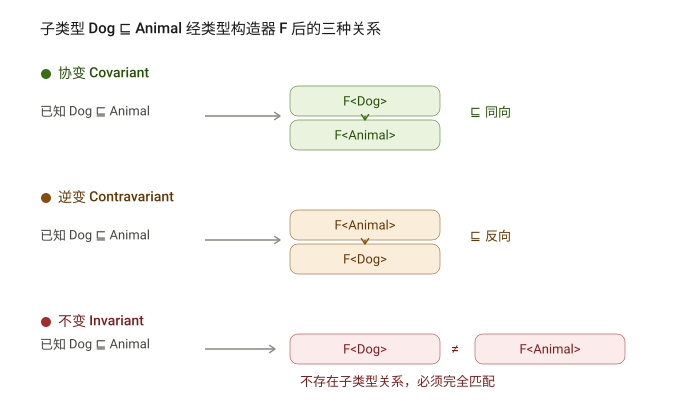

# TypeScript 高级类型

## 高级类型

### class 类

TypeScript 全面支持 ES2015 中引入的 `class` 关键字，并为其添加了类型注解和其他语法（比如，可见性修饰符等）。

**class 基本使用，如下：**

```ts
class Person {}
```

```ts
const p: Person = new Person();
```

**解释：**

1. 根据 TS 中的类型推论，可以知道 `Person` 类的实例对象 `p` 的类型是 `Person`。
2. TS 中的 `class`，不仅提供了 class 的语法功能，也作为一种类型存在。

---

**实例属性初始化：**

```ts
class Person {
  age: number;
  gender = "男";
}
```

**解释：**

1. 声明成员 `age`，类型为 `number`（没有初始值）。
2. 声明成员 `gender`，并设置初始值，此时，可省略类型注解（TS 类型推论为 `string` 类型）。

---

**构造函数：**

```ts
class Person {
  age: number;
  gender: string;

  constructor(age: number, gender: string) {
    this.age = age;
    this.gender = gender;
  }
}
```

**解释：**

1. 需要为构造函数指定类型注解，否则会被隐式推断为 `any`；构造函数不需要返回值类型。

---

**实例方法：**

```ts
class Point {
  x = 10;
  y = 10;

  scale(n: number): void {
    this.x *= n;
    this.y *= n;
  }
}
```

**解释：** 方法的类型注解（参数和返回值）与函数用法相同。

#### ts的继承和实现

**类继承的两种方式：**

1. `extends`（继承父类）
2. `implements`（实现接口）

说明：JS 中只有 `extends`，而 `implements` 是 TS 提供的。

---

```ts
class Animal {
  move() {
    console.log("Moving along!");
  }
}

class Dog extends Animal {
  bark() {
    console.log("汪！");
  }
}

const dog = new Dog();
```

**解释：**

1. 通过 `extends` 关键字实现继承。
2. 子类 `Dog` 继承父类 `Animal`，则 `Dog` 的实例对象 `dog` 就同时具有了父类 `Animal` 和子类 `Dog` 的所有属性和方法。

---

```ts
interface Singable {
  sing(): void;
}

class Person implements Singable {
  sing() {
    console.log("你是我的小呀小苹果儿");
  }
}
```

**解释：**

1. 通过 `implements` 关键字让 class 实现接口。
2. `Person` 类实现接口 `Singable` 意味着，`Person` 类必须提供 `Singable` 接口中指定的所有方法和属性。

#### 可见性修饰符

类成员可见性：可以使用 TS 来控制 class 的方法或属性对于 class 外的代码是否可见。

可见性修饰符包括：

1. `public`（公有的）
2. `protected`（受保护的）
3. `private`（私有的）

| 修饰符      | 可见范围                                                   |
| ----------- | ---------------------------------------------------------- |
| `public`    | 所有地方（默认）                                           |
| `protected` | 当前类、子类内部（可通过 `this` 访问），但不能通过实例访问 |
| `private`   | 仅限当前类内部（子类和实例均无法访问）                     |

---

1. `public`：表示公有的、公开的，公有成员可以被任何地方访问，**默认可见性**。

```ts
class Animal {
  public move() {
    console.log("Moving along!");
  }
}
```

**解释：**

1. 在类属性或方法前面添加 `public` 关键字，来修饰该属性或方法是共有的。
2. 因为 `public` 是默认可见性，所以**可以直接省略**。

---

2. `protected`：表示受保护的，仅对其声明所在类和子类中（非实例对象）可见。

```ts
class Animal {
  protected move() {
    console.log("Moving along!");
  }
}

class Dog extends Animal {
  bark() {
    console.log("汪！");
    this.move();
  }
}
```

**解释：**

1. 在类属性或方法前面添加 `protected` 关键字，来修饰该属性或方法是受保护的。
2. 在子类的方法内部可以通过 `this` 来访问父类中受保护的成员，但是，**对实例不可见！**

> ⚠️ 示例说明：`dog.move()` 会报错，因为 `move` 是 `protected`，不能通过实例直接调用。

---

3. `private`：表示私有的，只在当前类中可见，对实例对象以及子类也是不可见的。

```ts
class Animal {
  private move() {
    console.log("Moving along!");
  }
  walk() {
    this.move();
  }
}
```

**解释：**

1. 在类属性或方法前面添加 `private` 关键字，来修饰该属性或方法是私有的。
2. 私有的属性或方法只在当前类中可见，对子类和实例对象也都是不可见的！

> ⚠️ 示例说明：`dog.move()` 和 `Dog` 类内部调用 `this.move()` 都会报错，因为 `move` 是 `private`。

#### 只读修饰符

除了可见性修饰符之外，还有一个常见修饰符就是：`readonly`（只读修饰符）。

`readonly`：表示只读，用来防止在构造函数之外对属性进行赋值。

```ts
class Person {
  readonly age: number = 18;
  constructor(age: number) {
    this.age = age;
  }
}
```

**解释：**

1. 使用 `readonly` 关键字修饰该属性是只读的，注意只能修饰属性不能修饰方法。
2. 注意：属性 `age` 后面的类型注解（比如，此处的 `number`）如果不加，则 `age` 的类型为 `18`（字面量类型）。
3. 接口或者 `{}` 表示的对象类型，也可以使用 `readonly`。

### 类型兼容性

两种类型系统：

1. Structural Type System（结构化类型系统）
2. Nominal Type System（标明类型系统）

TS 采用的是结构化类型系统，也叫做 duck typing（鸭子类型），**类型检查关注的是值所具有的形状**。

也就是说，在结构类型系统中，如果两个对象具有相同的形状，则认为它们属于同一类型。

```ts
class Point {
  x: number;
  y: number;
}
class Point2D {
  x: number;
  y: number;
}

const p: Point = new Point2D();
```

**解释：**

1. `Point` 和 `Point2D` 是两个名称不同的类。
2. 变量 `p` 的类型被显示标注为 `Point` 类型，但是，它的值却是 `Point2D` 的实例，并且没有类型错误。
3. 因为 TS 是结构化类型系统，只检查 `Point` 和 `Point2D` 的结构是否相同（相同，都具有 `x` 和 `y` 两个属性，属性类型也相同）。
4. 但是，如果在 Nominal Type System 中（比如，C#、Java 等），它们是不同的类，类型无法兼容。

注意：在结构化类型系统中，如果两个对象具有相同的形状，则认为它们属于同一类型，这种说法并不准确。

**更准确的说法：源对象成员数 ≥ 目标类型成员数时，源可赋值给目标（如 `Point3D` 实例可赋给 `Point` 变量）**

```ts
class Point {
  x: number;
  y: number;
}
class Point3D {
  x: number;
  y: number;
  z: number;
}
const p: Point = new Point3D();
```

**解释：**

1. `Point3D` 的成员**至少与** `Point` 相同，则 `Point` 兼容 `Point3D`。
2. 所以，成员多的 `Point3D` 可以赋值给成员少的 `Point`。

> ✅ 示例说明：`Point3D` 包含了 `x`、`y`、`z`，而 `Point` 只需要 `x` 和 `y`，因此 `Point3D` 实例可以赋值给 `Point` 类型变量。

除了 class 之外，TS 中的其他类型也存在相互兼容的情况，包括：

1. 接口兼容性
2. 函数兼容性等。

- 接口之间的兼容性，类似于 class。并且，class 和 interface 之间也可以兼容。

```ts
interface Point {
  x: number;
  y: number;
}
interface Point2D {
  x: number;
  y: number;
}
let p1: Point;
let p2: Point2D = p1;

interface Point3D {
  x: number;
  y: number;
  z: number;
}
let p3: Point3D;
p2 = p3;

class Point3D {
  x: number;
  y: number;
  z: number;
}
let p3: Point2D = new Point3D();
```

#### 函数间的类型兼容性

函数之间兼容性比较复杂，需要考虑：

1. 参数个数
2. 参数类型
3. 返回值类型。

::: info 参数个数
参数个数：参数多的兼容参数少的（或者说，参数少的可以赋值给参数多的）。

```ts
type F1 = (a: number) => void;
type F2 = (a: number, b: number) => void;
let f1: F1;
let f2: F2 = f1;
```

```ts
const arr = ["a", "b", "c"];
arr.forEach(() => {});
arr.forEach((item) => {});
```

**解释：**

1. 参数少的可以赋值给参数多的，所以 `f1` 可以赋值给 `f2`。
2. 数组 `forEach` 方法的第一个参数是回调函数，该示例中类型为：`(value: string, index: number, array: string[]) => void`。
3. 在 JS 中省略用不到的函数参数实际上是很常见的，这样的使用方式，促成了 TS 中函数类型之间的兼容性。
4. 并且因为回调函数是有类型的，所以 TS 会自动推导出参数 `item`、`index`、`array` 的类型。

:::

::: info 参数类型
参数类型：相同位置的参数类型要相同（原始类型）或兼容（对象类型）。

```ts
type F1 = (a: number) => string;
type F2 = (a: number) => string;
let f1: F1;
let f2: F2 = f1;
```

**解释：**  
函数类型 `F2` 兼容函数类型 `F1`，因为 `F1` 和 `F2` 的第一个参数类型相同。

> ✅ 当参数类型为原始类型（如 `number`、`string`）时，必须完全一致才能兼容。

---

```ts
interface Point2D {
  x: number;
  y: number;
}
interface Point3D {
  x: number;
  y: number;
  z: number;
}
type F2 = (p: Point2D) => void;
type F3 = (p: Point3D) => void;
let f2: F2;
let f3: F3 = f2;
f2 = f3;
```

> ⚠️ 最后一行 `f2 = f3` 会报错！

**解释：**

1. 注意：参数类型兼容性，参数少的可以赋值给参数多的，但是反过来不行。【逆变】
2. 技巧：将对象拆开，把每个属性看做一个参数，则，参数少的（`f2`）可以赋值给参数多的（`f3`）。
   - 因为 `Point3D` 包含了 `Point2D` 的所有成员，所以 `Point3D` 类型可以赋值给 `Point2D` 类型。
   - 但反过来不行：`f3` 是 `(p: Point3D)`，而 `f2` 要求的是 `(p: Point2D)`，不能保证 `z` 被正确处理 → 所以 `f2 = f3` 不合法。

:::

::: info 返回值类型

返回值类型：只关注返回值类型本身即可。

```ts
type F5 = () => string;
type F6 = () => string;
let f5: F5;
let f6: F6 = f5;
```

```ts
type F7 = () => { name: string };
type F8 = () => { name: string; age: number };
let f7: F7;
let f8: F8;
f7 = f8;
```

**解释：**

1. 如果返回值类型是原始类型，此时两个类型要相同，比如左侧类型 `F5` 和 `F6`。
2. 如果返回值类型是对象类型，此时成员多的可以赋值给成员少的，比如右侧类型 `F7` 和 `F8`。
   - 因为 `F8` 返回的对象包含 `name` 和 `age`，而 `F7` 只需要 `name`，所以 `f8` 可以赋值给 `f7`。

> ✅ 结论：
>
> - 函数返回值类型兼容规则与**对象类型兼容规则一致**：
>   > 成员多的返回值可以赋值给成员少的返回值类型（即“宽泛兼容”）。

:::

### 交叉类型

**交叉类型（&）**：功能类似于接口继承（extends），用于组合多个类型为一个类型（常用于对象类型）。

比如，

```ts
interface Person {
  name: string;
}
interface Contact {
  phone: string;
}
type PersonDetail = Person & Contact;
let obj: PersonDetail = {
  name: "jack",
  phone: "133...",
};
```

**解释**：使用交叉类型后，新的类型 `PersonDetail` 就**同时具备了** `Person` 和 `Contact` 的所有属性类型。

相当于，

```ts
type PersonDetail = { name: string; phone: string };
```

> ✅ 说明：交叉类型将多个类型“合并”成一个新的类型，要求对象必须满足所有参与类型的约束。

#### & 和 extends的对比

- **相同点**：都可以实现对象类型的组合。
- **不同点**：两种方式实现类型组合时，对于**同名属性之间**，处理类型冲突的方式不同。

1. 接口继承（extends）

```ts
interface A {
  fn: (value: number) => string;
}

interface B extends A {
  fn: (value: string) => string;
}
```

> ❌ 报错！因为 `B` 继承 `A` 时，重写了 `fn` 方法，但参数类型不兼容（`number` vs `string`），导致类型冲突。

2. 交叉类型（&）

```ts
interface A {
  fn: (value: number) => string;
}

interface B {
  fn: (value: string) => string;
}

type C = A & B;
```

> ✅ 没有错误。可以理解为函数重载。
>
> ```ts
> interface C {
>   fn(value: number): string;
>   fn(value: string): string;
> }
> ```

### 泛型

#### 泛型介绍

**泛型**是在保证类型安全的前提下，让函数等与多种类型一起工作，从而实现复用，常用于：函数、接口、class 中。

**需求：创建一个 id 函数，传入什么数据就返回该数据本身**
（也就是说，参数和返回值类型相同）

```ts
function id(value: number): number {
  return value;
}
```

> 比如，`id(10)` 调用以上函数就会直接返回 10 本身。但是，该函数只接收数值类型，无法用于其他类型。

为了能让函数能够接受任意类型，可以将参数类型修改为 `any`。但是，这样就失去了 TS 的类型保护，类型不安全。

```ts
function id(value: any): any {
  return value;
}
```

**泛型**在保证类型安全（不丢失类型信息）的同时，可以让函数与多种不同的类型一起工作，灵活可复用。

实际上，在 C# 和 Java 等编程语言中，泛型都是用来实现可复用组件功能的主要工具之一。

```ts
function id<T>(value: T): T {
  return value;
}
```

#### 泛型的基本使用

**创建泛型函数：**

```ts
function id<Type>(value: Type): Type {
  return value;
}
```

**解释：**

1. 语法：在函数名称的后面添加 `<>`（尖括号），尖括号中添加类型变量，比如此处的 `Type`。
2. 类型变量 `Type`，是一种特殊类型的变量，它处理**类型**而不是值。
3. 该类型变量相当于一个**类型容器**，能够捕获用户提供的类型（具体是什么类型由用户调用该函数时指定）。
4. 因为 `Type` 是类型，因此可以将其作为函数参数和返回值的类型，表示参数和返回值具有相同的类型。
5. 类型变量 `Type`，可以是任意合法的变量名称。

**调用泛型函数：**

```ts
function id<Type>(value: Type): Type {
  return value;
}
```

调用示例：

```ts
const num = id<number>(10);
```

```ts
const str = id<string>("a");
```

**解释：**

1. 语法：在函数名称的后面添加 `<>()`（尖括号），尖括号中指定具体的类型，比如此处的 `number` 或 `string`。
2. 当传入类型 `number` 后，这个类型就会被函数声明时指定的类型变量 `Type` 捕获到。
3. 此时，`Type` 的类型就是 `number`，所以函数 `id` 参数和返回值的类型也都是 `number`。同样，如果传入类型 `string`，函数 `id` 参数和返回值的类型就都是 `string`。

#### 简化泛型函数的调用

**简化调用泛型函数：**

```ts
function id<Type>(value: Type): Type {
  return value;
}
```

示例对比：

```ts
let num: number;
let num = id<number>(10);
```

→

```ts
let num: number;
let num = id(10);
```

**解释：**

1. 在调用泛型函数时，可以省略 `<类型>` 来简化泛型函数的调用。
2. 此时，TS 内部会采用一种叫**类型参数推断**的机制，来根据传入的实参自动推断出类型变量 `Type` 的类型。
3. 比如，传入实参 `10`，TS 会自动推断出变量 `num` 的类型是 `number`，并作为 `Type` 的类型。

> ✅ 推荐：使用这种简化的方式调用泛型函数，使代码更短，更易于阅读。
>
> 当编译器无法推断类型，或者推断的类型不准确时，就需要**显式地传入类型参数**。

#### 泛型约束

**添加泛型约束以收缩类型，主要有以下两种方式：**

1. 指定更加具体的类型
2. 添加约束

**方式 1：指定更加具体的类型**

```ts
function id<Type>(value: Type[]): Type[] {
  console.log(value.length);
  return value;
}
```

> ✅ 解释：比如，将类型修改为 `Type[]`（Type 类型的数组），因为只要是数组就一定存在 `length` 属性，因此就可以访问了。

---

**方式 2：添加约束**

```ts
interface ILength {
  length: number;
}
function id<Type extends ILength>(value: Type): Type {
  console.log(value.length);
  return value;
}
```

**解释：**

1. 创建描述约束的接口 `ILength`，该接口要求提供 `length` 属性。
2. 通过 `extends` 关键字使用该接口，为泛型（类型变量）添加约束。
3. 该约束表示：**传入的类型必须具有 `length` 属性**。

> **注意：** 传入的实参（比如数组）只要具有 `length` 属性即可，这也符合前面讲到的接口的类型兼容性。

> ✅ 示例：
>
> ```ts
> id([1, 2, 3]); // ✅ 可以
> id({ length: 5 }); // ✅ 可以（只要满足接口）
> id("hello"); // ✅ 字符串也有length，所以合法
> ```

**泛型的类型变量可以有多个，并且类型变量之间还可以约束**（比如，第二个类型变量受第一个类型变量约束）。

示例：创建一个函数来获取对象中属性的值

```ts
function getProp<Type, Key extends keyof Type>(obj: Type, key: Key) {
  return obj[key];
}

let person = { name: "jack", age: 18 };
getProp(person, "name");
```

**解释：**

1. 添加了第二个类型变量 `Key`，两个类型变量之间使用 `,`（逗号）分隔。
2. `keyof` 关键字接收一个对象类型，生成其键名称（可能是字符串或数字）的联合类型。
3. 本示例中 `keyof Type` 实际上获取的是 `person` 对象所有键的联合类型，也就是：`'name' | 'age'`。
4. 类型变量 `Key` 受 `Type` 约束，可以理解为：`Key` 只能是 `Type` 所有键中的任意一个，或者说只能访问对象中存在的属性。

#### 泛型接口

**泛型接口：接口也可以配合泛型来使用，以增加其灵活性，增强其复用性。**

示例代码：

```ts
interface IdFunc<Type> {
  id: (value: Type) => Type;
  ids: () => Type[];
}
```

```ts
let obj: IdFunc<number> = {
  id(value) {
    return value;
  },
  ids() {
    return [1, 3, 5];
  },
};
```

**解释：**

1. 在接口名称的后面添加 `<类型变量>`，那么，这个接口就变成了**泛型接口**。
2. 接口的类型变量，对接口中所有其他成员可见，也就是**接口中所有成员都可以使用类型变量**。
3. 使用泛型接口时，需要显式指定具体的类型（比如，此处的 `IdFunc<number>`）。
4. 此时，`id` 方法的参数和返回值类型都是 `number`；`ids` 方法的返回值类型是 `number[]`。

---

**实际上，JS 中的数组在 TS 中就是一个泛型接口。**

示例代码：

```ts
const strs = ['a', 'b', 'c']
strs.forEach
// 显示：
Array<string>.forEach(callbackfn: (value: string, index: number, array: string[]) => void, thisArg?: any): void
```

```ts
const nums = [1, 3, 5]
nums.forEach
// 显示：
Array<number>.forEach(callbackfn: (value: number, index: number, array: number[]) => void, thisArg?: any): void
```

**解释：** 当我们在使用数组时，TS 会根据数组的不同类型，自动将类型变量设置为相应的类型。

**技巧提示：** 可以通过 **Ctrl + 鼠标左键**（Mac: Option + 鼠标左键）来查看具体的类型信息。

#### 泛型类

**创建泛型类**

```ts
class GenericNumber<NumType> {
  defaultValue: NumType;
  add: (x: NumType, y: NumType) => NumType;
}
```

**解释：**

1. 类似于泛型接口，在 `class` 名称后面添加 `<类型变量>`，这个类就变成了**泛型类**。
2. 此处的 `add` 方法，采用的是箭头函数形式的类型书写方式。

实例化泛型类：

```ts
const myNum = new GenericNumber<number>();
myNum.defaultValue = 10;
```

**说明：** 类似于泛型接口，在创建 class 实例时，在类名后面通过 `<类型>` 来指定明确的类型。

#### 泛型工具类型

**泛型工具类型：TS 内置了一些常用的工具类型，来简化 TS 中的一些常见操作。**

**说明：**  
它们都是基于泛型实现的（泛型适用于多种类型，更加通用），并且是内置的，可以直接在代码中使用。

这些工具类型有很多，主要学习以下几个：

1. `Partial<Type>`
2. `Readonly<Type>`
3. `Pick<Type, Keys>`
4. `Record<Keys, Type>`

---

::: info Partial

**泛型工具类型 - `Partial<Type>` 用来构造（创建）一个类型，将 Type 的所有属性设置为可选。**

示例代码：

```ts
interface Props {
  id: string;
  children: number[];
}

type PartialProps = Partial<Props>;
```

**解释：**  
构造出来的新类型 `PartialProps` 结构和 `Props` 相同，但所有属性都变为可选的。

> ✅ 等价于：
>
> ```ts
> interface PartialProps {
>   id?: string;
>   children?: number[];
> }
> ```

:::

::: info Readonly

**泛型工具类型 - `Readonly<Type>` 用来构造一个类型，将 Type 的所有属性都设置为 readonly（只读）。**

示例代码：

```ts
interface Props {
  id: string;
  children: number[];
}

type ReadonlyProps = Readonly<Props>;

let props: ReadonlyProps = { id: "1", children: [] };
props.id = "2"; // ❌ 报错！无法分配到 "id"，因为它是只读属性。
```

**解释：**  
构造出来的新类型 `ReadonlyProps` 结构和 `Props` 相同，但所有属性都变为只读的。

> ⚠️ 尝试修改 `props.id` 会报错，因为 `Readonly` 禁止重新赋值。

:::

::: info Pick

**泛型工具类型 - `Pick<Type, Keys>` 从 Type 中选择一组属性来构造新类型。**

示例代码：

```ts
interface Props {
  id: string;
  title: string;
  children: number[];
}

type PickProps = Pick<Props, "id" | "title">;
```

**解释：**

1. `Pick` 工具类型有两个类型变量：
   - 第一个表示“选择谁的属性”
   - 第二个表示“选择哪几个属性”

2. 其中第二个类型变量，如果只选择一个，则只传入该属性名即可。

3. 第二个类型变量传入的属性只能是第一个类型变量中存在的属性。

4. 构造出来的新类型 `PickProps`，只有 `id` 和 `title` 两个属性类型。

> ✅ 等价于：
>
> ```ts
> interface PickProps {
>   id: string;
>   title: string;
> }
> ```

:::

::: info Record

**泛型工具类型 - `Record<Keys, Type>` 构造一个对象类型，属性键为 Keys，属性类型为 Type。**

示例代码：

```ts
type RecordObj = Record<"a" | "b" | "c", string[]>;

let obj: RecordObj = {
  a: ["1"],
  b: ["2"],
  c: ["3"],
};
```

**解释：**

1. `Record` 工具类型有两个类型变量：
   - 第一个表示“对象有哪些属性”（键的联合类型）
   - 第二个表示“对象属性的类型”

2. 构建的新对象类型 `RecordObj` 表示：这个对象有三个属性分别为 `a` / `b` / `c`，属性值的类型都是 `string[]`。

> ✅ `Record` 常用于定义固定键名的对象结构，如配置项、状态映射等。

:::

### 索引签名类型

> **绝大多数情况下，我们都可以在使用对象前就确定对象的结构，并为对象添加准确的类型。**
>
> **使用场景：当无法确定对象中有哪些属性（或者说对象中可以出现任意多个属性），此时，就用到索引签名类型了。**

示例代码：

```ts
interface AnyObject {
  [key: string]: number;
}
```

```ts
let obj: AnyObject = {
  a: 1,
  b: 2,
};
```

**解释：**

1. 使用 `[key: string]` 来约束该接口中允许出现的属性名称。表示只要是 `string` 类型的属性名称，都可以出现在对象中。
2. 这样，对象 `obj` 就可以出现任意多个属性（比如，a、b 等）。
3. `key` 只是一个占位符，可以换成任意合法的变量名称。
4. 隐藏的前置知识：JS 中对象 `{}` 的键是 `string` 类型的。

> ✅ 说明：  
> 索引签名允许你定义一个“动态属性”的接口，适用于键名不确定但值类型固定的场景。

---

> **在 JS 中数组是一类特殊的对象，特殊在数组的键（索引）是数值类型。**
>
> 并且，数组也可以出现任意多个元素。所以，在数组对应的泛型接口中，也用到了索引签名类型。

示例代码：

```ts
interface MyArray<T> {
  [n: number]: T;
}

let arr: MyArray<number> = [1, 3, 5];
```

**解释：**

1. `MyArray` 接口模拟原生的数组接口，并使用 `[n: number]` 作为索引签名类型。
2. 该索引签名类型表示：只要是 `number` 类型的键（索引）都可以出现在数组中，或者说数组中可以有任意多个元素。
3. 同时也符合数组索引是 `number` 类型这一前提。

> ✅ 说明：  
> 数组的本质是“以数字为键的对象”，因此 TypeScript 用 `[n: number]: T` 来模拟其行为。

### 映射类型

> **映射类型：基于旧类型创建新类型（对象类型），减少重复、提升开发效率。**

比如，类型 `PropKeys` 有 `x/y/z`，另一个类型 `Type1` 中也有 `x/y/z`，并且 `Type1` 中 `x/y/z` 的类型相同：

示例代码：

```ts
type PropKeys = "x" | "y" | "z";
type Type1 = { x: number; y: number; z: number };
```

这样书写没错，但 `x/y/z` 重复书写了两次。像这种情况，就可以使用**映射类型**来进行简化。

简化写法：

```ts
type PropKeys = "x" | "y" | "z";
type Type2 = { [Key in PropKeys]: number };
```

**解释：**

1. 映射类型是基于索引签名类型的，所以该语法类似于索引签名类型，也使用了 `[]`。
2. `Key in PropKeys` 表示 `Key` 可以是 `PropKeys` 联合类型中的任意一个，类似于 `for (let k in obj)`。
3. 使用映射类型创建的新对象类型 `Type2` 和类型 `Type1` 结构完全相同。
4. 注意：**映射类型只能在类型别名中使用，不能在接口中使用。**

---

> **映射类型除了根据联合类型创建新类型外，还可以根据对象类型来创建：**

示例代码：

```ts
type Props = { a: number; b: string; c: boolean };
type Type3 = { [key in keyof Props]: number };
```

**解释：**

1. 首先，先执行 `keyof Props` 获取到对象类型 `Props` 中所有键的联合类型，即 `'a' | 'b' | 'c'`。
2. 然后，`key in ...` 就表示 `key` 可以是 `Props` 中所有的键名称中的任意一个。

#### 泛型工具类型Partial

> **实际上，前面讲到的泛型工具类型（比如 `Partial<Type>`）都是基于映射类型实现的。**
>
> 比如，`Partial<Type>` 的实现：

示例代码：

```ts
type Partial<T> = {
  [P in keyof T]?: T[P];
};
```

```ts
type Props = { a: number; b: string; c: boolean };
type PartialProps = Partial<Props>;
```

**解释：**

1. `keyof T` 即 `keyof Props` 表示获取 `Props` 的所有键，也就是 `'a' | 'b' | 'c'`。
2. 在 `[ ]` 后面添加 `?`（问号），表示将这些属性变为**可选的**，以此来实现 `Partial` 的功能。
3. 冒号后面的 `T[P]` 表示获取 `T` 中每个键对应的类型。例如：
   - 如果是 `'a'`，则类型是 `number`
   - 如果是 `'b'`，则类型是 `string`
   - 如果是 `'c'`，则类型是 `boolean`
4. 最终，新类型 `PartialProps` 和旧类型 `Props` 结构完全相同，只是让所有属性都变为可选了。

#### 索引查询类型

> **刚刚用到的 `T[P]` 语法，在 TS 中叫做索引查询（访问）类型。**
>
> **作用：用来查询属性的类型。**

示例代码：

```ts
type Props = { a: number; b: string; c: boolean };

type TypeA = Props["a"];
```

**解释：**  
`Props['a']` 表示查询类型 `Props` 中属性 `'a'` 对应的类型 `number`。所以，`TypeA` 的类型为 `number`。

> ✅ 注意：
>
> - `[]` 中的属性必须存在于被查询类型中，否则就会报错。
> - 这是一种**类型查询**，不是运行时操作，只在编译期生效。

---

> **索引查询类型的其他使用方式：同时查询多个索引的类型**

示例代码 1：

```ts
type Props = { a: number; b: string; c: boolean };
type TypeA = Props["a" | "b"]; // string | number
```

**解释：**  
使用字符串字面量的联合类型，获取属性 `a` 和 `b` 对应的类型，结果为：`string | number`。

示例代码 2：

```ts
type TypeA = Props[keyof Props]; // string | number | boolean
```

**解释：**  
使用 `keyof` 操作符获取 `Props` 中所有键对应的类型，结果为：`string | number | boolean`。

## 附录

### 附录1: 协变和逆变

**协变/逆变/不变** 描述的是：当 `A` 是 `B` 的子类型（`A ⊑ B`）时，把它套进某个「类型构造器」`F`（比如 `Array<T>`、`Promise<T>`、`(x: T) => void`）之后，`F<A>` 和 `F<B>` 之间还保不保持子类型关系、方向变不变。

| 关系                   | 已知 `A ⊑ B` 时 | 赋值方向     | 口诀         |
| ---------------------- | --------------- | ------------ | ------------ |
| **协变 Covariant**     | `F<A> ⊑ F<B>`   | 同方向       | 子类型跟着走 |
| **逆变 Contravariant** | `F<B> ⊑ F<A>`   | 反方向       | 子类型反过来 |
| **不变 Invariant**     | 两者都不是      | 必须完全匹配 | 一丝不能差   |

> 补充：TS 里还有一种 **双变（bivariant）** —— 双向都能赋值，这其实是不安全的，主要出现在「类的方法参数」上（历史兼容原因）。



```ts
interface Animal {
  name: string;
}
interface Dog extends Animal {
  bark(): void;
}

// ① 返回值位置 → 协变
type Producer<T> = () => T;
let produceDog: Producer<Dog>;
let produceAnimal: Producer<Animal>;
// ✅ 协变：Dog ⊑ Animal ⇒ Producer<Dog> ⊑ Producer<Animal>
produceAnimal = produceDog;

// ② 参数位置 → 逆变（strictFunctionTypes 开启时）
type Consumer<T> = (x: T) => void;
let consumeAnimal: Consumer<Animal>;
let consumeDog: Consumer<Dog>;
// ✅ 逆变：Dog ⊑ Animal ⇒ Consumer<Animal> ⊑ Consumer<Dog>
consumeDog = consumeAnimal;
```

**为什么参数要逆变（安全角度）？**

- `consumeDog` 的调用方只会喂它 `Dog`；`consumeAnimal` 能处理**任意** `Animal`，当然也能处理 `Dog`。
- 把「更宽泛的消费者」赋给「更严格的位置」是安全的 → 方向反转成逆变。
- 反过来 `consumeAnimal = consumeDog` 不安全：`consumeAnimal` 可能被喂一只 `Cat`，而 `consumeDog` 只会 `bark`，运行时炸。

::: info 面试 Q&A
**Q1：什么是协变/逆变？**  
A：描述「子类型关系」经过类型构造器后，是否保持、反转、或丢失。

**Q2：为什么函数返回值协变、参数逆变？**  
A：返回值被「往外给」，越具体越好 → 协变；参数被「往里吃」，越宽泛越安全 → 逆变。
:::
