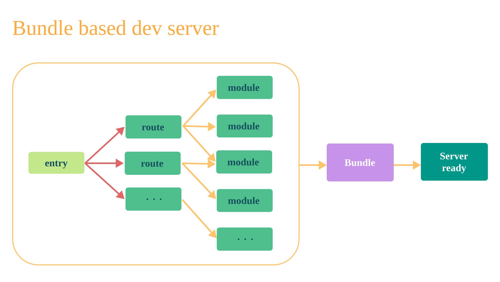
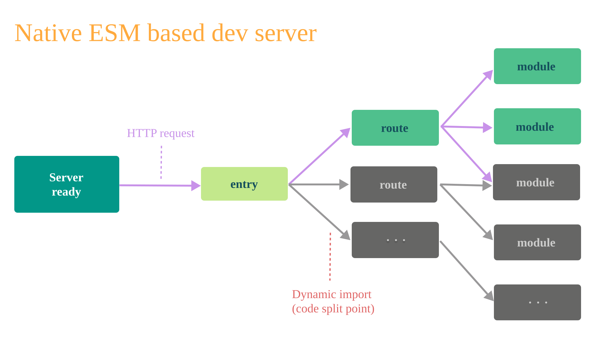
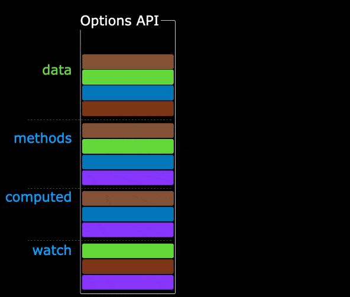

# Vue3 基础

## vue3 简介

::: info 改进点

**性能提升**

- 打包大小减少 41%
- 初次渲染快 55%，更新渲染快 133%
- 内存减少 54%

**源码升级**

- 使用 **Proxy** 代替 **defineProperty** 实现响应式
- 重写虚拟 DOM 实现和 Tree-Shaking

**TypeScript 支持**

- Vue3 更好地支持 TypeScript，类型推导更完善

**新特性**

| 类别            | 内容                                                       |
| --------------- | ---------------------------------------------------------- |
| Composition API | `setup`、`ref`、`reactive`、`computed`、`watch`            |
| 内置组件        | `Fragment`、`Teleport`、`Suspense`                         |
| 其他改变        | 新的生命周期钩子、data 必须声明为函数、移除 keyCode 修饰符 |

:::

## 创建 vue3 工程

::: info 基于 vue-cli 创建

[vue-cli官方文档：创建一个项目](https://cli.vuejs.org/zh/guide/creating-a-project.html#vue-create)

> 目前 `vue-cli` 已处于维护模式，官方推荐基于 `Vite` 创建项目。

```bash
## 查看@vue/cli版本，确保@vue/cli版本在4.5.0以上
vue --version

## 安装或者升级你的@vue/cli
npm install -g @vue/cli

## 执行创建命令
vue create vue_test

## 随后选择3.x
## Choose a version of Vue.js that you want to start the project with
## > 3.x
##   2.x

## 启动
cd vue_test
npm run serve
```

:::

::: info 基于 vite 创建（推荐）

vite 是新一代前端构建工具，官网地址：https://vitejs.cn/

`vite`的优势如下:

- 轻量快速的热重载 (HMR)，能实现极速的服务启动。
- 对 TypeScript、JSX、CSS 等支持开箱即用。
- 真正的按需编译，不再等待整个应用编译完成。

[官方文档：创建一个 Vue 项目](https://cn.vuejs.org/guide/quick-start.html#creating-a-vue-application)

```bash
## 创建命令
npm create vue@latest

## 根据提示配置TypeScript 和测试支持之类的可选功能

## 启动
cd <your-project-name>
npm install
npm run dev
```

:::

::: info webpack 构建 与 vite 构建对比图如下





:::

> vscode插件推荐
>
> - Vue Language Features (Volar)
> - TypeScript Vue Plugin (Volar)

## Vue3 核心语法

### CompositionAPI

- Vue2 的 API 设计是 Options（配置）风格的。

  > Options API 的弊端：
  >
  > - 数据、方法、计算属性等，分散在：data、methods、computed 中。
  > - 新增或者修改一个需求，就需要分别修改：data、methods、computed，不便于维护和复用。

- Vue3 的 API 设计是 Composition（组合）风格的。
  > Composition API 的优势：
  >
  > - 可以用函数的方式，更加优雅的组织代码，让相关功能的代码更加有序的组织在一起。
  > - 可以将组件的逻辑拆分成多个函数，每个函数负责一个功能，方便维护和复用。



### setup 函数

#### setup 基本使用

setup 是 Vue3 中一个新的配置项，值是一个函数，它是 Composition API “表演的舞台”，组件中所用到的：数据、方法、计算属性、监视......等等，均配置在 setup 中。

**特点如下：**

- setup 函数返回的对象中的内容，可直接在模板中使用。
- setup 中访问 this 是 undefined。
- setup 函数会在 beforeCreate 之前调用，它是“领先”所有钩子执行的。

```vue
<template>
  <div class="person">
    <h2>姓名：{{ name }}</h2>
    <h2>年龄：{{ age }}</h2>
    <button @click="changeName">修改名字</button>
    <button @click="changeAge">年龄+1</button>
  </div>
</template>

<script lang="ts">
export default {
  name: "Person",
  setup() {
    // 数据，原来写在data中（注意：此时的name、age、tel数据都不是响应式数据）
    let name = "张三";
    let age = 18;

    // 方法，原来写在methods中
    function changeName() {
      name = "zhang-san"; //注意：此时这么修改name页面是不变化的
    }
    function changeAge() {
      age += 1; //注意：此时这么修改age页面是不变化的
    }

    // 返回一个对象，对象中的内容，模板中可以直接使用
    return { name, age, changeName, changeAge };
  },
};
</script>
```

::: info setup 返回值

- 若返回一个对象：则对象中的：属性、方法等，在模板中均可以直接使用 **（重点关注）**
- 若返回一个函数：则可以自定义渲染内容。Vue 会忽略该组件的 `<template>`，直接执行这个返回的函数来决定渲染什么

:::

::: warning ⚠️ 注意
**setup与Options API的关系**  
Vue2 的配置（data、methods...）中可以访问到 setup中的属性、方法。  
但在setup中不能访问到Vue2的配置（data、methods...）。  
如果与Vue2冲突，则setup优先。
:::

#### setup 语法糖

`<script setup>` 是 `setup()` 的编译时语法糖，更简洁。

| 特性        | setup()     | `<script setup>`            |
| ----------- | ----------- | --------------------------- |
| 返回值      | 需要 return | 自动暴露                    |
| 组件注册    | 需声明      | 自动注册                    |
| props/emits | 通过参数    | `defineProps`/`defineEmits` |
| 代码量      | 多          | 少                          |

```vue
<script setup>
import Child from "./Child.vue";

const props = defineProps({ name: String });
const emit = defineEmits(["update"]);

const count = ref(0);
const double = computed(() => count.value * 2);

function handleClick() {
  emit("update", count.value);
}
</script>
```

---

扩展：上述代码，还需要编写一个不写 setup 的 script 标签，去指定组件名字，比较麻烦，我们可以借助 vite 中的插件简化（Vue < 3.3）。**3.3+版本使用原生方法 `defineOptions`**。

::: info vite-plugin-vue-setup-extend 插件

1. 第一步：`npm i vite-plugin-vue-setup-extend -D`
2. 第二步：`vite.config.ts`

```ts
import { defineConfig } from "vite";
import VueSetupExtend from "vite-plugin-vue-setup-extend";

export default defineConfig({
  plugins: [VueSetupExtend()],
});
```

3. 第三步：`<script setup lang="ts" name="Person">`

:::

::: info defineOptions 函数

```vue
<script setup lang="ts">
defineOptions({
  name: "Person",
});
</script>
```

:::

### ref 函数

#### ref 创建：基本类型的响应式数据

- **作用：** 定义响应式变量。
- **语法：** `let xxx = ref(初始值)`。
- **返回值：** 一个 `RefImpl` 的实例对象，简称 `ref对象` 或 `ref` ， `ref` 对象的 `value` 属性是响应式的。
- **注意点：**
  - JS 中操作数据需要： `xxx.value` ，但模板中不需要 `.value` ，直接使用即可。
  - 对于 `let name = ref('张三')` 来说， `name` 不是响应式的， `name.value` 是响应式的。

```vue
<template>
  <div class="person">
    <h2>姓名：{{ name }}</h2>
    <button @click="changeName">修改名字</button>
  </div>
</template>

<script setup lang="ts" name="Person">
import { ref } from "vue";
// name和age是一个RefImpl的实例对象，简称ref对象，它们的value属性是响应式的。
let name = ref("张三");

function changeName() {
  // JS中操作ref对象时候需要.value
  name.value = "李四";
  console.log(name.value);

  // 注意：name不是响应式的，name.value是响应式的，所以如下代码并不会引起页面的更新。
  // name = ref('zhang-san')
}
</script>
```

#### reactive 创建：对象类型的响应式数据

- **作用：** 定义一个响应式对象（基本类型不要用它，要用 `ref` ，否则报错）
- **语法：** `let 响应式对象 = reactive(源对象)`。
- **返回值：** 一个 `Proxy` 的实例对象，简称：响应式对象。
- **注意点：** `reactive` 定义的响应式数据是“深层次”的。

```vue
<template>
  <div class="person">
    <h2>汽车信息：一台{{ car.brand }}汽车，价值{{ car.price }}万</h2>
    <ul>
      <li v-for="g in games" :key="g.id">{{ g.name }}</li>
    </ul>
    <button @click="changeCarPrice">修改汽车价格</button>
    <button @click="changeFirstGame">修改第一游戏</button>
  </div>
</template>

<script lang="ts" setup name="Person">
import { reactive } from "vue";

// 数据
let car = reactive({ brand: "奔驰", price: 100 });
let games = reactive([
  { id: "ahsgdyfa01", name: "英雄联盟" },
  { id: "ahsgdyfa02", name: "王者荣耀" },
  { id: "ahsgdyfa03", name: "原神" },
]);

function changeCarPrice() {
  car.price += 10;
}
function changeFirstGame() {
  games[0].name = "流星蝴蝶剑";
}
</script>
```

#### ref 创建：对象类型的响应式数据

- ref接收的数据可以是：基本类型、对象类型。
- 若ref接收的是对象类型，内部其实也是调用了reactive函数。

```vue
<template>
  <div class="person">
    <h2>汽车信息：一台{{ car.brand }}汽车，价值{{ car.price }}万</h2>
    <ul>
      <li v-for="g in games" :key="g.id">{{ g.name }}</li>
    </ul>
    <button @click="changeCarPrice">修改汽车价格</button>
    <button @click="changeFirstGame">修改第一游戏</button>
  </div>
</template>

<script lang="ts" setup name="Person">
import { ref } from "vue";

// 数据
let car = ref({ brand: "奔驰", price: 100 });
let games = ref([
  { id: "ahsgdyfa01", name: "英雄联盟" },
  { id: "ahsgdyfa02", name: "王者荣耀" },
  { id: "ahsgdyfa03", name: "原神" },
]);

function changeCarPrice() {
  car.value.price += 10;
}
function changeFirstGame() {
  games.value[0].name = "流星蝴蝶剑";
}
</script>
```

#### ref 对比 reactive

::: info ref 对比 reactive

1. `ref` 用来定义：**基本类型数据**、**对象类型数据**；
2. `reactive` 用来定义：**对象类型数据**。

**区别**：

1. `ref` 创建的变量必须使用 `.value` （可以使用 `volar` 插件自动添加 `.value` ）。
2. `reactive` 重新分配一个新对象，会**失去响应式**（可以使用 `Object.assign` 去整体替换）。

**使用原则**：

1. 若需要一个基本类型的响应式数据，必须使用 `ref` 。
2. 若需要一个响应式对象，层级不深， `ref` 、 `reactive` 都可以。
3. 若需要一个响应式对象，且层级较深，推荐使用 `reactive` 。

:::

#### toRefs 与 toRef

- 作用：将一个响应式对象中的每一个属性，转换为 `ref` 对象。
- 备注：`toRefs` 与 `toRef` 功能一致，但 `toRefs` 可以批量转换。

```vue
<script lang="ts" setup name="Person">
import { ref, reactive, toRefs, toRef } from "vue";

// reactive 版本
let person = reactive({ name: "张三", age: 18, gender: "男" });
let { name, gender } = toRefs(person);
let age = toRef(person, "age");

// ref 版本：ref 包裹对象时，需通过 .value 访问底层对象
let personRef = ref({ name: "李四", age: 20, gender: "女" });
let { name: nameRef, gender: genderRef } = toRefs(personRef.value);
let ageRef = toRef(personRef.value, "age");
</script>
```

### computed 函数

作用：根据已有数据计算出新数据（和Vue2中的computed作用一致）。

```vue
<template>
  <div class="person">
    姓：<input type="text" v-model="firstName" /> <br />
    名：<input type="text" v-model="lastName" /> <br />
    全名：<span>{{ fullName }}</span> <br />
    <button @click="changeFullName">全名改为：li-si</button>
  </div>
</template>

<script setup lang="ts" name="App">
import { ref, computed } from "vue";

let firstName = ref("zhang");
let lastName = ref("san");

// 计算属性——只读取，不修改
/* let fullName = computed(()=>{
    return firstName.value + '-' + lastName.value
  }) */

// 计算属性——既读取又修改
let fullName = computed({
  // 读取
  get() {
    return firstName.value + "-" + lastName.value;
  },
  // 修改
  set(val) {
    console.log("有人修改了fullName", val);
    firstName.value = val.split("-")[0];
    lastName.value = val.split("-")[1];
  },
});

function changeFullName() {
  fullName.value = "li-si";
}
</script>
```

### watch 函数

**作用：** 监视数据的变化（和 Vue2 中的 watch 作用一致）  
**特点：** Vue3 中的 watch 只能监视以下四种数据：1. ref 定义的数据；2. reactive 定义的数据；3. 函数返回一个值（getter 函数）；4. 一个包含上述内容的数组。

我们在 Vue3 中使用 watch 的时候，通常会遇到以下 5 种情况：

::: info 1.监视ref定义的基本数据类型
监视ref定义的【基本类型】数据：直接写数据名即可，监视的是其value值的改变。

```vue
<script lang="ts" setup name="Person">
import { ref, watch } from "vue";
// 数据
let sum = ref(0);
// 监视，情况一：监视【ref】定义的【基本类型】数据
const stopWatch = watch(sum, (newValue, oldValue) => {
  console.log("sum变化了", newValue, oldValue);
  if (newValue >= 10) {
    stopWatch();
  }
});
</script>
```

:::

::: info 2.监视ref定义的对象数据类型

监视ref定义的【对象类型】数据：直接写数据名，监视的是对象的【地址值】，若想监视对象内部的数据，要手动开启深度监视。

```vue
<script lang="ts" setup name="Person">
import { ref, watch } from "vue";
// 数据
let person = ref({
  name: "张三",
  age: 18,
});
/* 
    监视，情况一：监视【ref】定义的【对象类型】数据，监视的是对象的地址值，若想监视对象内部属性的变化，需要手动开启深度监视
    watch的第一个参数是：被监视的数据
    watch的第二个参数是：监视的回调
    watch的第三个参数是：配置对象（deep、immediate等等.....） 
  */
watch(
  person,
  (newValue, oldValue) => {
    console.log("person变化了", newValue, oldValue);
  },
  { deep: true },
);
</script>
```

::: warning ⚠️ 注意

1. 若修改的是ref定义的对象中的属性，newValue 和 oldValue 都是新值，因为它们是同一个对象。
2. 若修改整个ref定义的对象，newValue 是新值， oldValue 是旧值，因为不是同一个对象了。

:::

::: info 3.监视reactive定义的对象数据类型

监视reactive定义的【对象类型】数据，且默认开启了深度监视。

```vue
<script lang="ts" setup name="Person">
import { reactive, watch } from "vue";
// 数据
let person = reactive({
  name: "张三",
  age: 18,
});
// 监视，情况三：监视【reactive】定义的【对象类型】数据，且默认是开启深度监视的
watch(person, (newValue, oldValue) => {
  console.log("person变化了", newValue, oldValue);
});
</script>
```

:::

::: info 4.监视ref或reactive定义的对象类型数据中的某个属性

监视ref或reactive定义的【对象类型】数据中的某个属性，注意点如下：

1. 若该属性值不是【对象类型】，需要写成函数形式。
2. 若该属性值是依然是【对象类型】，可直接编，也可写成函数，建议写成函数。

结论：监视的要是对象里的属性，那么最好写函数式，注意点：若是对象监视的是地址值，需要关注对象内部，需要手动开启深度监视。

```vue
<script lang="ts" setup name="Person">
import { reactive, watch } from "vue";

// 数据
let person = reactive({
  name: "张三",
  age: 18,
  car: {
    c1: "奔驰",
    c2: "宝马",
  },
});

// 监视，情况四：监视响应式对象中的某个属性，且该属性是基本类型的，要写成函数式
/* watch(()=> person.name,(newValue,oldValue)=>{
    console.log('person.name变化了',newValue,oldValue)
  }) */

// 监视，情况四：监视响应式对象中的某个属性，且该属性是对象类型的，可以直接写，也能写函数，更推荐写函数
watch(
  () => person.car,
  (newValue, oldValue) => {
    console.log("person.car变化了", newValue, oldValue);
  },
  { deep: true },
);
</script>
```

:::

::: info 5.监视上述的多个数据

```vue
<template>
  <script lang="ts" setup name="Person">
    import { reactive, watch } from "vue";

    // 数据
    let person = reactive({
      name: "张三",
      age: 18,
      car: {
        c1: "奔驰",
        c2: "宝马",
      },
    });

    // 监视，情况五：监视上述的多个数据
    watch(
      [() => person.name, person.car],
      (newValue, oldValue) => {
        console.log("person.car变化了", newValue, oldValue);
      },
      { deep: true },
    );
  </script>
</template>
```

:::

### watchEffect 函数

### 标签的 ref 属性

### props 函数

### vue3 生命周期

### 自定义 Hooks

## 路由

## pinia 状态管理库

## 组件通信

## 插槽

## 其他 API

## Vue3 新组件
