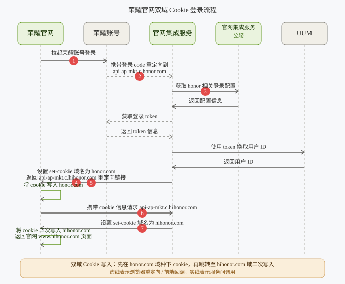
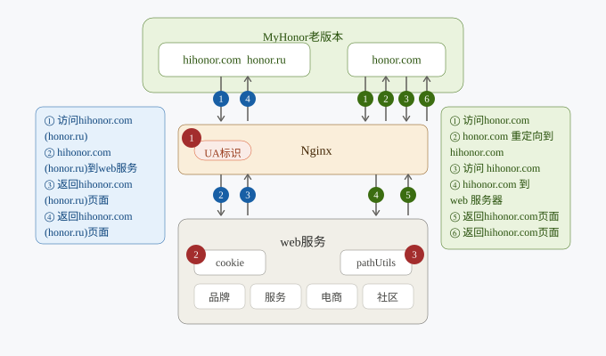

# 域名切换专项

> 目标：新增 `www.honor.com` 替换 `www.hihonor.com` 老域名，完成荣耀官网域名切换。

## 整体方案概览

### 架构流程


### 工作梳理

| 序号 | 任务               | 具体内容                                                                               |
| ---- | ------------------ | -------------------------------------------------------------------------------------- |
| 1    | DNS 域名配置       | 新增 `www.honor.com` 域名                                                              |
| 2    | HTTPS 证书配置     | 采购 `*.honor.com` 证书                                                                |
| 3    | CDN 配置           | ① 新增新域名缓存策略、路由策略；② 新增老域名跳转到新域名策略                           |
| 4    | WAF 配置           | 新增域名 WAF 配置                                                                      |
| 5    | Nginx 反向代理配置 | 新增域名反向代理配置                                                                   |
| 6    | SEO 优化           | ① 更新搜索引擎信息；② 301 重定向；③ 刷新站点地图                                       |
| 7    | GA 流量切换        | 保证流量平稳切换                                                                       |
| 8    | 上游服务开发联调   | 涉及 21 个系统，跨域整改，解决跨域 Cookie 读写、跨域 AJAX 请求，保证集成的后端接口访问 |
| 9    | 下游服务开发联调   | 涉及 1 个系统                                                                          |
| 10   | 荣耀官网内链修改   | 统一替换为 `www.honor.com`                                                             |
| 11   | 全站测试           | 涉及 54 个国家站点切换测试                                                             |
| 12   | 运维监控配置       | 修改监控域名                                                                           |
| 13   | 测试环境搭建       | 新增测试环境域名，搭建测试环境                                                         |

## Nginx 方案


::: info 方案要点

1. **新域名配置**：新增 `honor.com` 域名配置，与 `hihonor.com` 域名隔离。
2. **重定向**：`hihonor.com` 域名 301 重定向到 `honor.com`。
3. **缓存**：开启缓存，降低新域名请求对 Web 服务的压力。

:::

## 荣耀官网内链整站刷新


| 步骤               | 内容                                                                                              |
| ------------------ | ------------------------------------------------------------------------------------------------- |
| ① 站点内链检索刷新 | 在编辑环境检索站点内包含 `www.hihonor.com` 或 `www.honor.ru` 的链接配置项，修改为 `www.honor.com` |
| ② 站点发布         | 推送内链刷新结果至现网                                                                            |
| ③ 缓存清理         | 清理当前站点的 Dispatcher 及 CDN 缓存                                                             |

## 荣耀账号登录方案



| 序号 | 内容                                                                                                        |
| ---- | ----------------------------------------------------------------------------------------------------------- |
| 1    | **登录白名单配置**：账号新增 `honor.com` 相关域名回调白名单配置                                             |
| 2    | **新增集成服务域名**：集成服务新增 honor 域名，与原 hihonor 域名指向同一 CLB，域名证书挂载在各自域名下      |
| 3    | **登录配置**：公服新增 honor 域名配置，确保灰度期间不影响线上登录，支持集成服务 honor 和 hihonor 双域名登录 |
| 4    | **首次写入 cookie**：根据登录的域名将 cookie 写入到对应域名上                                               |
| 5    | **登录信息封装**：将需要双写的 cookie 信息和官网地址作为参数封装，重定向至集成服务另一域名上                |
| 6    | **新增二次写入 cookie 新方法**：调用集成服务 hihonor 域名的二次写入方法                                     |
| 7    | **二次写入 cookie**：二次写入 cookie 到 hihonor 域名下，完成 cookie 双写                                    |

## SEO 方案

| 方案                 | 作用                                                                                                | 示例                                                                         |
| -------------------- | --------------------------------------------------------------------------------------------------- | ---------------------------------------------------------------------------- |
| Canonical            | 指示网页首选版本，解决重复内容、集中权重、优化索引                                                  | `<link rel="canonical" href="https://www.honor.com/uk/" />`                  |
| Hreflang + alternate | 指示网页的语言和地区版本，多语言多地区优化、避免重复内容、支持国际化                                | `<link rel="alternate" href="https://www.honor.com/cn/" hreflang="zh-CN" />` |
| 结构化数据           | 用 Schema.org 标记描述内容结构，提高搜索引擎理解、丰富搜索结果、优化排名                            | 官网使用 **JSON-LD**（业界主流），另有 Microdata、RDFa                       |
| Sitemap + robots.txt | 网站地图帮助搜索引擎抓取、提高索引效率、优化排名；`sitemap.xml` 面向引擎，`sitemap.html` 面向消费者 | 见下                                                                         |

`sitemap.xml` 示例：

```xml
<?xml version="1.0" encoding="UTF-8"?>
<urlset xmlns="http://www.sitemaps.org/schemas/sitemap/0.9">
  <url>
    <mobile:mobile type="pc,mobile" />
    <loc>https://www.honor.com/cn/</loc>
    <priority>1.0</priority>
    <lastmod>2025-05-26</lastmod>
    <changefreq>always</changefreq>
  </url>
  <url>
    <mobile:mobile type="pc,mobile" />
    <loc>https://www.honor.com/cn/phones/</loc>
    <priority>0.8</priority>
    <lastmod>2025-05-26</lastmod>
    <changefreq>always</changefreq>
  </url>
</urlset>
```

## MyHonor APP 免升级兼容方案

> _MyHonor 老版本 App 仍使用 `hihonor.com` / `honor.ru` 域名，需要通过 Nginx 做 UA 识别，使其在无需升级的情况下兼容新的 `honor.com` 域名。_



| 模块                      | 内容                                                                                                                                     |
| ------------------------- | ---------------------------------------------------------------------------------------------------------------------------------------- |
| 1. Nginx 配置             | 根据 `$http_user_agent` 中的 `appversion` 信息识别老版本 App：① `honor.com` 重定向到 `hihonor.com`；② `honor.com/ru` 重定向到 `honor.ru` |
| 2. Cookie 操作            | Web 服务 cookie 增删操作仅针对当前访问页面域名：① `location` 中获取当前页面域名；② 向当前域名写入 / 移除 cookie，不存在 cookie 跨域问题  |
| 3. PathUtils 相对路径重写 | ① 仅保留通用规则 `/content/honor/` → `/`；② 废弃 RU 特有规则 `/content/honor/ru/` → `/`                                                  |
