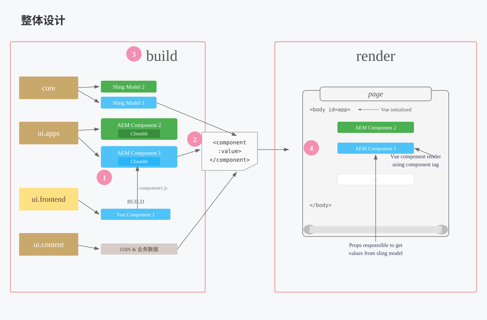

# VUE&AEM专项

## 业务背景

::: tip AEM开发模式演进

```
JSP模式 → Sling + OSGi模式 → HTL模式（We are here） → SPA模式 → AEMaaCS模式
```

:::

**HTL 开发模式**

- **前端开发**：按照 UI 稿开发静态页面，引用 Sling 类数据替换动态变量来渲染动态内容
- **AEM 开发**：根据业务需求和 UI 来决定需要暴露的配置项，开发组件 Dialog 和 Sling Model 来处理和封装数据

::: info 当前痛点 与 目标

**当前痛点：**

- 无法做到前后端分离并行开发
- AEM 顾问全部替换后，对前端要求额外的 AEM-Dev 能力，如：
  - HTL Block Statements
  - Dialog
  - Sling Model
- 导致官网前端前期学习曲线陡峭，难以上手

---

**目标：**

基于 HTL 开发模式构建 **AEM & Vue 的非 SPA ui.frontend 集成框架**

- **前端**专注于前端组件开发
- **后端（AEM-Dev）** 专注于数据内容交付

:::

## 整体设计

**架构概览：**



::: info 核心设计思想

> JSON 数据约定，AEM maven 工程安装 node.js 构建的 frontend 模块，自定义前端脚手架，命令行式完成组件与 dialog 的初始化操作，前后端隔离：前端专注于视图，后端专注于数据。

1. **脚手架实现组件初始化**
   - **ui.frontend**：基于 node.js 构建自定义脚手架，支持命令行式初始化组件模板与组件 dialog
   - **core**：遵循数据约定，构建 CommonModel 类实现 Sling Model 数据封装与挂载，专注数据交付
   - **ui.apps**：初始化 AEM 组件用于挂载 build 后的 Vue 组件

2. **JSON 数据约定**
   - 封装 `CommonModel` 类实现 Sling Model 的 Resource 数据格式化
   - 组件通过 `sly` 指令 + `value` 属性实现格式化数据的注入

3. **AEM 集成构建方案**
   - **frontend-maven-plugin**：AEM 装包时自动集成前端工程
   - 基于 **webpack** 构建，打通 AEM 组件与 Vue 组件集成对应关系，支撑 AEM & Vue 的集成化构建

4. **自定义组件渲染逻辑**
   - 封装 Vue 组件实例渲染逻辑，主动监听 DOM 加载状态控制 Vue 实例执行解析
   - 整合 AEM 工程全局方法至 Vue 原型，供各组件实例使用

:::
