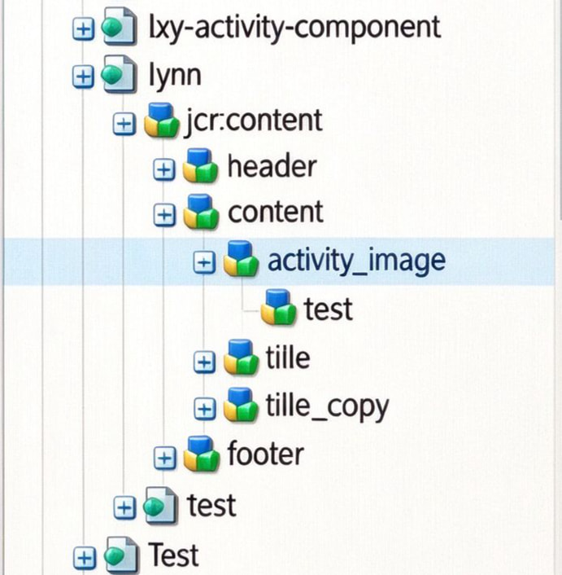
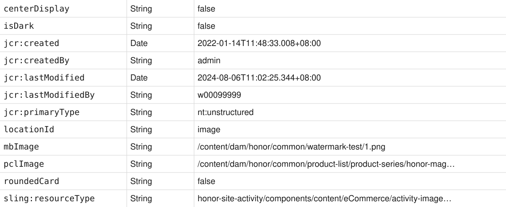
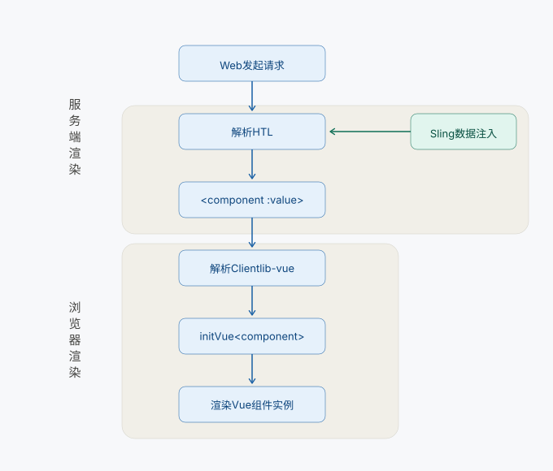

# VUE&AEM专项

## 业务背景

::: tip AEM开发模式演进

```
JSP模式 → Sling + OSGi模式 → HTL模式（We are here） → SPA模式 → AEMaaCS模式
```

:::

**HTL 开发模式**

- **前端开发**：按照 UI 稿开发静态页面，引用 Sling 类数据替换动态变量来渲染动态内容
- **AEM 开发**：根据业务需求和 UI 来决定需要暴露的配置项，开发组件 Dialog 和 Sling Model 来处理和封装数据

::: info 当前痛点 与 目标

**当前痛点：**

- 无法做到前后端分离并行开发
- AEM 顾问全部替换后，对前端要求额外的 AEM-Dev 能力，如：
  - HTL Block Statements
  - Dialog
  - Sling Model
- 导致官网前端前期学习曲线陡峭，难以上手

---

**目标：**

基于 HTL 开发模式构建 **AEM & Vue 的非 SPA ui.frontend 集成框架**

- **前端**专注于前端组件开发
- **后端（AEM-Dev）** 专注于数据内容交付

:::

## 整体设计

**架构概览：**


::: info 核心设计思想

> JSON 数据约定，AEM maven 工程安装 node.js 构建的 frontend 模块，自定义前端脚手架，命令行式完成组件与 dialog 的初始化操作，前后端隔离：前端专注于视图，后端专注于数据。

1. **脚手架实现组件初始化**
   - **ui.frontend**：基于 node.js 构建自定义脚手架，支持命令行式初始化组件模板与组件 dialog
   - **core**：遵循数据约定，构建 CommonModel 类实现 Sling Model 数据封装与挂载，专注数据交付
   - **ui.apps**：初始化 AEM 组件用于挂载 build 后的 Vue 组件

2. **JSON 数据约定**
   - 封装 `CommonModel` 类实现 Sling Model 的 Resource 数据格式化
   - 组件通过 `sly` 指令 + `value` 属性实现格式化数据的注入

3. **AEM 集成构建方案**
   - **frontend-maven-plugin**：AEM 装包时自动集成前端工程
   - 基于 **webpack** 构建，打通 AEM 组件与 Vue 组件集成对应关系，支撑 AEM & Vue 的集成化构建

4. **自定义组件渲染逻辑**
   - 封装 Vue 组件实例渲染逻辑，主动监听 DOM 加载状态控制 Vue 实例执行解析
   - 整合 AEM 工程全局方法至 Vue 原型，供各组件实例使用

:::

## 关键设计点

### 设计点1：脚手架完成组件初始化操作

**要点：**

- 封装前端脚手架，支持**命令行自动生成 Vue 组件和 AEM 组件模板**，降低前端对 HTL Block Statements 能力的要求。
- 用 **Commander** 构建自定义命令，动态替换 Vue/AEM 组件模板参数。

::: info 封装自定义命令（package.json）

```json
"script": {
  "dev": "webpack-dev-server",
  "prod": "webpack --config webpack.prod.js --mode production",
  "create": "node ./script/create/index.js",
  "dialog": "node ./script/dialog init"
}
```

:::

::: info create 命令核心逻辑（script/create/index.js）

```js
const init = async (name) => { … }
const cwd = process.cwd();

// 模板目录
const srcDir = path.resolve(cwd, "script/dialog/template");
// 目标目录：直接落到 ui.apps 的 JCR 组件目录
const destDir = path.resolve(cwd,
  "../../ui.apps/src/main/content/jcr_root/apps/honor-site-activity/components/content/${name}");

if (fs.existsSync(destDir)) { … }   // 已存在则中断

markLog('loading...')                       // 加载动画
await copyDir(srcDir, destDir);     // 拷贝模板

let copnone = name.slice(name.lastIndexOf("/") + 1);
// 组件 html 重命名为组件名
fs.renameSync(`${destDir}/component.html`, `${destDir}/${copname}.html`);

setTimeout(() => { log('done'); }, 500);
```

:::

::: info 组件模板目录结构（script/）

```txt

script/
├── create/
│   ├── template/            ← vue组件模板
│   │   ├── component.css
│   │   ├── component.html
│   │   ├── component.js
│   │   └── index.html
│   ├── index.js
│   └── init.js
└── dialog/
    ├── template/            ← aem组件模板
    │   ├── _cq_dialog/
    │   │   └── .content.xml
    │   ├── clientlib/
    │   │   ├── .content.xml
    │   │   ├── css.txt
    │   │   └── js.txt
    │   ├── .content.xml
    │   └── template.html
    ├── index.js
    └── init.js


```

:::

::: info 组件开发整体流程

```txt
npm run dialog        npm run create        开发组件逻辑      npm run build        npm run prod
创建AEM组件    ──▶    创建Vue组件     ──▶    （编码）     ──▶   编译Vue组件   ──▶    构建AEM组件
```

:::

### 设计点2：JSON 数据约定

**要点：**

- 封装 **CommonModel 类**实现 Sling Model 的 Resource 数据格式化，剔除 AEM 原生属性，**递归处理 Sling Model 子类**的数据。
- 前端组件通过 **sly 指令 + value 属性**实现 Resource 数据的注入。
- CommonModel 封装后，AEM 新增组件**不再需要对 Sling Model 的配套开发**，真正做到前后端分离并行开发。

::: info CommonModel 类（Java）

```java
/**
 * 公共sling model，将节点内容转化成json输出，并格式化属性值
 *
 */
@Model(adaptables = SlingHttpServletRequest.class, defaultInjectionStrategy = DefaultInjectionStrategy.OPTIONAL)
public class CommonModel {
    private static final Pattern MULTI_FIELD_NODE = Pattern.compile("item[0-9]+");

    private static final Pattern GENERIC_MULTI_FIELD_NODE = Pattern.compile("[0-9]+[_][0-9]+");

    @PostConstruct
    public void init() {
        siteCode = PageUtils.getHomePage(currentPage).getName();

        properties = handleResource(resource);

        if (properties != null && properties.size() > 0) {
            Gson gson = new Gson();
            propJson = gson.toJson(properties);
        }
    }

    private Map<String, Object> handleResource(Resource resource) {
        Map<String, Object> props = Maps.newHashMap();
        ValueMap valueMap = resource.getValueMap();
        props.putAll(valueMap);
        formatProperties(filterProperties(props));
    }
}

```

:::

::: info 前端组件引用（HTL）

```html
<sly
  data-sly-use.component="com.honor.site.activity.core.components.CommonModel"
/>

<sly data-sly-use.templates="core/wcm/components/commons/v1/templates.html" />
<sly
  data-sly-call="${templates.placeholder @ isEmpty = wcmmode.edit && !component.propJson}"
/>

<div data-component="activity-image" data-sly-test="${component.propJson}">
  <div
    class="skeleton skeleton-line"
    style="--bg: #f2f2f2;--l-h: 600px; --c-w:100%;"
  ></div>
  <activity-image value="${component.propJson}" />
</div>
```

:::

::: info AEM 属性存储结构（crx/de）





```json
{
  "isDark": "false",
  "centerDisplay": "false",
  "locationId": "image",
  "mbImage": "/content/dam/honor/common/watermark-test/1.png",
  "pcImage": "/content/dam/honor/common/product-list/product-series/honor-magic6-ultimate/honor-magic6-ultimate-right-pc.jpg",
  "roundedCard": "false",
  "test": {
    "newOpen1": "true"
  }
}
```

:::

### 设计点3：AEM 集成构建方案

**要点：**

- 引入 **frontend-maven-plugin**，自动安装 Node.js 环境，编译前端项目。
- 封装 webpack 配置文件，**分类构建、抽离公共依赖**，支持组件**按需引入**，打通 AEM 组件与 Vue 组件集成关系，支持 maven 构建时组件化 frontend。
- 巧用 **AEM apps 重写逻辑**，实现 frontend 工程静态资源**免路径修改**集成。

::: info Pom 配置集成 frontend 工程构建

**父工程 POM（片段）**

```xml
<artifactId>honor-activity-website</artifactId>
<packaging>pom</packaging>
<version>1.0-SNAPSHOT</version>
<description>honor-activity-website</description>

<modules>
    <module>core</module>
    <module>ui.frontend</module>
    <module>ui.apps</module>
    <module>ui.content</module>
</modules>
```

**ui.frontend 子工程 POM（片段）**

```xml
<artifactId>honor-activity-website.ui.frontend</artifactId>
<name>Honor Activity Website - UI frontend</name>
<description>UI frontend package for Honor Activity Website</description>
<packaging>pom</packaging>
<version>1.0-SNAPSHOT</version>
```

**前端构建执行顺序**

```xml
<id>install node and npm</id>
   ↓
<id>npm install</id>
   ↓
<id>npm run prod</id>
```

:::
::: info 定义 npm 打包方法（webpack.prod.js）

**package.json配置**

```txt
"prod": "webpack --config webpack.prod.js --mode production"
```

**webpack splitChunks 配置**

```js
chunks["vendors"] = {
  test: /[\\/]node_modules[\\/]((?!(video)).*)[\\/]/,
  name: "clientlibs/clientlib-vue/js/vendor",
  chunks: "all",
  minSize: 0,
  priority: -10,
};

chunks["common"] = { name: "clientlibs/clientlib-vue/js/common" };
```

**组件入口收集（多入口打包）**

```js
let paramsFlag = params.length <= 0 ? true : false;

components.forEach((path: string) => {
  let dirs = path.replace(".src/components/", "").replace("/component.js", "");

  let dirname = dirs.slice(dirs.lastIndexOf("/") + 1);
  let filename = "component.js";

  let buildPath = `components/content/${dirs}/clientLib/js/${dirname}`;
  let buildSource = `./src/components/${dirs}/${filename}`;

  if (paramsFlag) {
    entries[buildPath] = buildSource;
  } else {
    params.forEach((param, index: number, params: any[]) => {
      if (param == dirname) {
        entries[buildPath] = buildSource;
        params.splice(index, 1);
      }
    });
  }
});
```

:::

### 设计点4：自定义组件渲染逻辑

**要点：**

- 封装 Vue 组件实例渲染逻辑，集成 frontend 工程**全局状态**。
- **主动监听 DOM 加载状态**控制 Vue 实例执行解析。
- 配合 AEM 工程全局方法**挂到 Vue 原型**，供各组件实例使用。

::: info 组件解析渲染流程



:::

::: info VUE 组件监听触发渲染

**1 — startApp 入口**

```js
function startApp() {
  initVue(gloddemo.name, gloddemo.component);
}

window.startApp = () => startApp();

document.addEventListener("DOMContentLoaded", startApp);
```

**2 — initVue 定义**

```js
export default function initVue(name, component, _store) {
  Vue.use(Vuex)
  Vue.component(name, component)
  if (!window.Honor) {...}

  _store ? modules[name] = _store : modules; // component's store
  const store = new Vuex.Store({modules: modules...});

  let i18n;
  if (!window.Honor) {...}

  if (!window.Granite || (window.Granite && !window.Granite.author)) {...}
  new Vue({
    el: el,
    store,
    i18n
  })
}
```

:::
